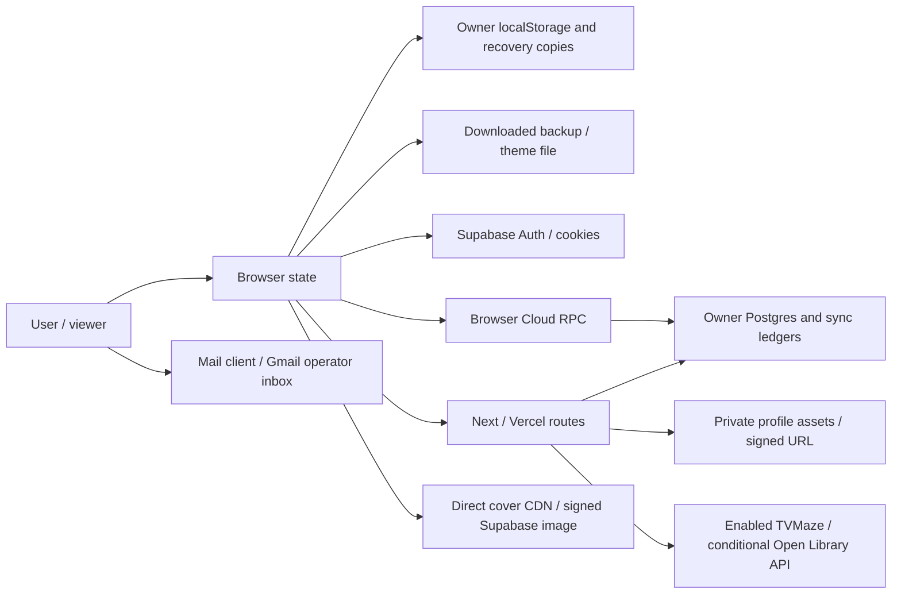
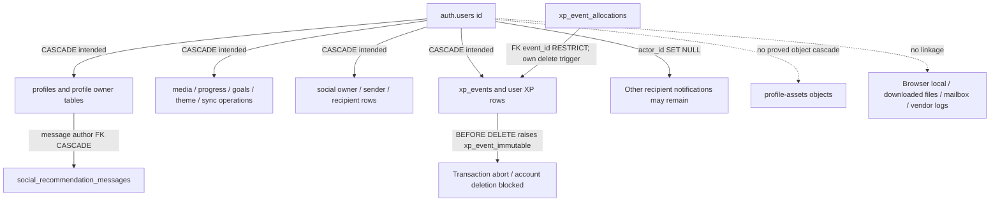

# V1-HARDENING-05A — Privacy factual data map and legal gap audit

Audit date: 2026-10-05. Scope: repository source, migration/config contracts, existing documentation, read-only GitHub CI metadata and official KVKK publications. **This is an audit/documentation phase, not implementation or a legal compliance assessment.** Runtime and migration facts describe the checked-out source; they do not attest deployed schema, environment, region, vendor contracts or actual user records.

## 1. Executive summary

**V1-HARDENING-05A COMPLETE — PRIVACY DATA MAP READY.** This verdict closes the factual audit deliverable only. Production release acceptance remains separate.

- The product is local-first, but local-first does not mean network-free: configured Auth, social/XP, optional Cloud, server deterministic recommendations and browser-direct images create separate processing surfaces.
- Personal-data-capable domains include Auth, media/progress/notes, goals, profile and assets, social activity/communications/reports, preferences/themes, recommendation sessions/feedback, XP, calendar, sync and recovery journals, security pseudonyms and support requests.
- Source deletion has material dependencies: immutable XP delete triggers and restrictive XP foreign keys prevent treating Auth deletion as automatic complete erasure; Storage is separate; other recipients' notifications can retain entity IDs/title payloads.
- Portable v3 exports six local domains; theme export is separate. Neither is a complete Auth/social/asset/operational export. The historical security/privacy document incorrectly includes themes among portable domains.
- Browser-direct cover hosts remain active for saved legacy records even when their provider API is disabled. Platform/mailbox retention and transfer mechanisms are not evidenced by repository code.
- `ARTICLE_9_MECHANISM = MANUAL_LEGAL_GATE`; `VERBIS_STATUS = MANUAL_OPERATOR_CONFIRMATION`; `DATA_SUBJECT_REQUEST_PROCESS = TECHNICALLY_PARTIAL / MANUAL / LEGAL_REVIEW_REQUIRED`.

No Production/Staging access, real user-data read, account export/delete, provider live request, remote mutation, external submission, deploy, commit or push occurred. No application source, migration, environment or privacy-page text was changed.

## 2. Baseline and boundaries

| Check | Result / evidence |
| --- | --- |
| Branch | `release/v1-hardening` — PASS |
| HEAD | `4aa3e92d19f2abb98cf3807552dfdca40679fec3` — PASS |
| Starting working tree | `git status --porcelain=v1` empty — PASS |
| Local remote-tracking ref | `origin/release/v1-hardening` equals HEAD; live read-only `git ls-remote` independently confirms the same SHA for `refs/heads/release/v1-hardening` |
| Previous phases | History and `docs/V1_HARDENING_01.md`, `V1_HARDENING_02A.md`, `V1_HARDENING_02B.md`, `V1_HARDENING_02C.md`, `V1_HARDENING_02D.md`, `V1_HARDENING_03.md`, `V1_HARDENING_04B1.md` through `V1_HARDENING_04B4.md`; prior measured/live acceptance is historical evidence, not repeated here |
| Latest exact-SHA GitHub CI | Read-only Actions API: run **37327155423**, workflow `CI`, push event, same branch/SHA, `completed/success`, completed 2026-10-05 17:46:01 Europe/Istanbul. [Run](https://github.com/Baglare/MediaTracker/actions/runs/37327155423) |
| CI distinction | Commit status `Vercel: success` alone was not used as proof of Actions CI. PR-filtered workflow wrapper returned no runs; the push-run collection supplied the CI evidence |
| Instructions | Workspace/root AGENTS, `.ai/project.md`, `.ai/automation.json`, relevant project-map domains, `supabase/AGENTS.md`; framework code unchanged |
| Vault | Configured read-only `kc vault context` failed `VAULT_GIT_INVALID`. No broad Vault search or write/sync attempted; explicit no-commit/push scope overrides autopilot writing |
| Live systems | Supabase, Vercel, Gmail/vendor accounts and deployed settings **NOT ACCESSED / LIVE UNVERIFIED** |

No secret-bearing local env file or stored browser/user dataset was inspected. Public config examples and source were inspected. GitHub reads concern repository metadata only. Tests used synthetic fixtures and the existing offline network preload.

## 3. Existing privacy surface audit

Evidence: `app/privacy/page.tsx`, `tests/d8-privacy-route.test.ts`, `README.md`, `docs/D8_FIRST_RELEASE_SECURITY_AND_PRIVACY.md`, settings/auth/public-topbar callers, ownership/storage helpers and the sources referenced below. `VERIFIED` means supported source behavior or literal published text; it does not verify an operator's civil identity, mailbox ownership, hosted settings or legal sufficiency.

| Current page claim | Classification | Factual support / limit |
| --- | --- | --- |
| Named operator Batuhan Parıltı | PARTIAL | Literal page and contract test agree; no independent identity/entity verification in code |
| Contact `mediatracker.contact@gmail.com` | VERIFIED | `mailto:` literal, tests and approved provider User-Agent; mailbox availability/ownership/process unverified |
| Guest tracking without account, browser storage | VERIFIED | Owner namespaces and local CRUD; includes notes/goals/preferences. Does not exclude image or recommendation runtime requests |
| Public signup disabled, authorized accounts can sign in | PARTIAL | No public `signUp` action; password sign-in exists. `supabase/config.toml` local `[auth]` and `[auth.email]` both say `enable_signup = true`; hosted Auth disabling remains manual, not established by UI removal |
| Auth/email/session processed by Supabase | VERIFIED | `hooks/use-auth.ts`, browser/server Supabase clients; cookies/session refresh |
| Profile/social/assets processed by Postgres/Storage | VERIFIED | Schema and social/assets routes; page omits reports, recommendation messages, XP, username history and local recovery copies |
| Optional owner-scoped Cloud library/goals | VERIFIED | Cloud contracts, mappings, revisions/queues; actual rollout/deployed settings unverified |
| Mostly local themes; opt-in theme/public snapshot sync | VERIFIED | Personal storage, `user_theme_preferences`, allowlisted public theme columns |
| TVMaze and Open Library are active public sources | PARTIAL | TVMaze enabled; Open Library requires valid `MEDIA_TRACKER_PROVIDER_USER_AGENT`, otherwise disabled. Technical readiness is not current Production enablement proof |
| Search providers do not receive private library/notes | VERIFIED | Search proxy forwards bounded query, provider IDs/UA; ordinary search does not forward library payload. Query itself can contain personal text |
| Supabase/Vercel may process technical metadata | VERIFIED | Hosting/runtime architecture, Auth and proxy boundaries; source does not establish vendor logging settings/retention/regions |
| AniList/TMDB/OMDb new public API disabled | VERIFIED | Central policy and guarded consumers. Saved cover/CDN rendering remains possible |
| Paid AI/research disabled; no paid AI transmission | PARTIAL | v1 policy defaults/contracts deny paid/research access; AI entitlement is still env-configurable. Hosted values unverified; deterministic request still sends selected data to Vercel |
| Library/progress and selected portable domains JSON export; notes selected | VERIFIED | Portable six-domain contract and UI; separate theme export, no comprehensive account export |
| Auth/assets/full social/notification history excluded from backup | VERIFIED | No corresponding portable domain or full-account export route |
| Per-media deletion, mock reset differs from complete deletion | VERIFIED | Local CRUD plus Cloud behavior; mock reset replaces data; browser site-data clearing is external/manual |
| No self-service account deletion | VERIFIED | No account-wide deletion route/UI; existing routes provide narrower CRUD only |
| Operator verifies identity, exports, deletes app/assets/Auth and verifies cleanup | UNSUPPORTED as completed capability | Page/runbook describe intended manual sequence, not a tested full-account export/deletion system; XP triggers/RESTRICT and residual data require explicit handling |
| No compliance/certification guarantee or confirmed geography | VERIFIED | Page makes neither assertion |

Historical doc: portable-theme coverage is **STALE** (portable v3 contains no theme domain); dormant-AI description is **PARTIAL** (local prompt/session persistence and deterministic Vercel processing must be explicit); operator deletion sequence is **PARTIAL** (no detailed XP/residual dependency handling). Old security/Staging outcomes remain historical, not fresh live verification. README local-first/optional Cloud and legacy CDN/API distinction are supported; older Production and ML fallback prose does not establish current live or v1 ML enablement.

## 4. Personal data inventory and data subjects

`POSSIBLE_LEGAL_BASIS` below is only an assessment candidate. All activities have `LEGAL_REVIEW_STATUS = MANUAL_LEGAL_REVIEW_REQUIRED`; no basis is confirmed by code. Optional setting/visibility selection is not proof of valid explicit consent. Purpose identifiers P01–P13 are expanded in section 12.

| ID / domain | FACTUAL_PROCESSING: origin, content, destinations | POSSIBLE_LEGAL_BASIS (candidate only) | Purpose / subjects |
| --- | --- | --- | --- |
| A Auth | Login form email/password → Supabase Auth; UUID, email, access/refresh session tokens, `user_metadata`, `app_metadata`, identity provider data, created/updated/confirmation/last-sign-in timestamps may be returned by SDK. No app password column; password transient in form/transport; Auth credential storage is platform-managed | Contract establishment/performance; legitimate interest for account security | P01/P02; authenticated user |
| B Library | Manual/provider/import media: title/type/status/progress/unit/total, rating/favorite/tags, personal notes, cover/backdrop/source IDs and whitelisted metadata; progress/action/title/delta/time logs → owner local storage, optional Postgres, portable JSON | Contract performance candidate | P03/P04; anonymous/authenticated owner |
| C Goals | User title, media link/type/library scope, targets/unit, weekly/monthly dates/time zone, lifecycle and timestamps → local `goals`, optional Cloud `definition`, queue/ledger, portable JSON | Contract performance candidate | P03/P04; owner |
| D Profile | Username/display name/tagline/bio/location/language, chosen title/color, visibility, modules/showcases/shared notes/stat/progression snapshots, image transforms, avatar/banner file/path and public theme → local preferences, Postgres/Storage, published projection | Contract performance; explicit consent candidate where actually required | P05; profile owner and viewers |
| E Social | Follow requests/statuses and blocks, activity media/rating/text/visibility, comments/threads, reactions, recommendations/media snapshots/sender and response notes/messages/event/dedupe IDs, notifications/payload/read state, reports/category/note and activity/notification settings → Postgres, browser outboxes/cache, other authorized users | Contract performance; legitimate interest candidate for abuse handling | P06/P10; interacting users, sender/recipient, reporter and report subject |
| F Preferences | Appearance/theme/layout/startup/UI/profile and notification/activity choices, custom theme JSON/cloud revision and public snapshot → local storage/cookie, optional Postgres | Contract performance candidate | P07; guest/account/profile owner |
| G Recommendation | User prompt, recent conversational context, active context, selected media/ratings/favorites/progress and optional notes/recent history, structured intent/preferences, generated recommendations/rejections and feedback → local owner session/feedback, Next/Vercel deterministic processing. `recommendation_feedback` schema supports prompt but no current app writer found | Contract performance candidate; optional future explicit consent review | P08; owner |
| H Sync/recovery | User UUID/scope, local record/canonical IDs, operation/idempotency/dedupe keys, revisions/hash, tombstone time, retries/errors, cursor/state, before/after recovery snapshots, import/ownership decisions → local queues/journals/quarantine/backup, Postgres operations | Contract performance; legitimate interest for integrity candidate | P04/P11; owner |
| I Security | Correlation UUID, route/method/status/latency/safe code, raw IP transient from trusted platform adapter, HMAC of user UUID/IP (IPv6 /64)/epoch/scope, receipt/envelope digests, quota state → Vercel memory/logs and private Postgres limiter | Legitimate interest candidate; statutory obligation only if operator identifies a concrete obligation | P02/P10; visitor/user |
| J Provider | Bounded search text/show/work/provider ID → server proxy → TVMaze/Open Library; operator UA/contact; normalized title/cover/metadata may later be saved. Browser cover request exposes network metadata independently | Contract performance candidate; separate recipient/transfer review | P09; searcher/viewer/operator contact |
| K Privacy/support | Applicant chooses `mailto:`: sender/account email, request body/attachments, correspondence and any later necessary identity material → user's mail provider, Gmail/operator mailbox. No in-app submission/storage/verification system | Legal obligation candidate for formal rights response; legitimate interest/contract candidate for informal support | P12; applicant/operator |
| L XP/calendar | Media-derived attested state, awards/levels/totals/badges/quests/import aggregates, source/reversal/canonical IDs → XP outbox/Postgres/public XP projection. Manual calendar dates/labels/hidden occurrence keys and provider releases → media metadata/local calendar cache | Contract performance candidate | P03/P05/P13; owner |
| M Dev annotation | Gated local development tool: annotator/reviewer identifiers, dataset source notes/tasks/annotations/adjudications/revocations and audit trail → operator filesystem JSON/NDJSON/backup/export; session assistance preference. Not a v1 hosted-user feature | UNKNOWN, separate operator/tool-purpose review | Evaluation only if explicitly enabled; annotator/operator |

Data subjects: anonymous visitors (technical metadata and guest data); authenticated users; public profile owners; other interacting users; recommendation senders/recipients; reporters/report subjects; privacy applicants; operator contact/annotation personnel if applicable. No dedicated special-category collection workflow, biometric matching, health record, payment card or geolocation capture was found in active app source. Profile images are not automatically biometric data. Taste is not automatically special-category data. Notes, bio/tagline/location, comments, recommendation messages/notes, reports, prompts, manual media/goal text and support attachments are `USER_SUPPLIED_FREE_TEXT_RISK`; user content could disclose special-category information. Metadata/free text can also describe third persons. The absence statement is source-scope bounded, not a claim about actual records.

## 5. Storage map

| Destination | Exact object/key family | Data / access / deletion boundary |
| --- | --- | --- |
| Browser localStorage | Section 7 key inventory | Guest/user media and personal domains, queues, recovery/legacy copies; browser profile/site lifetime |
| Browser cookies | `mediaTrackerAppearance`; SDK `sb-<project-ref>-auth-token` and chunk suffixes; possible `-code-verifier` in applicable SDK auth flows | Theme identity and Auth tokens/session/user payload; server can receive same-origin cookies. No custom tracker-cookie system found |
| Browser sessionStorage | `mediaTracker:ownProfile:v1:<ownerId>:summary/hero`, `mediaTracker:uiSection:<storageKey>`, `media-tracker-recommendation-draft`, `d7-annotation-assistance-mode` | Summary/hero incl. signed URL, collapse state, media draft, dev setting |
| Browser memory | Auth snapshot, local stores/current feature state, import/export preview/undo, in-flight requests and own-profile cache | Runtime lifetime; logout/owner transition guards do not erase persistent storage |
| IndexedDB | No application reference found in tracked app/lib/hooks/components/features | Do not infer browser/platform internal cache absence |
| Supabase Auth | `auth.users` and platform session/identity/credential infrastructure | SDK contract observed; complete managed Auth schema/logging/backup lifecycle not in app migrations |
| Supabase Postgres | Section 6 public tables; `private_rate_limit.*` | Owner/participant content and operations, pseudonym quota state; migrations describe intended schema only |
| Supabase Storage | Private bucket `profile-assets`, `<auth UUID>/<avatar\|banner>/<random UUID>.<jpg\|png\|webp>` | Uploaded files; separate object cleanup, signed current referenced paths |
| Vercel/runtime / process memory | Safe route handling, recommendation calculation, signed URL maps, limiter envelope, provider response/cache | Transient processing; cache expiry usually logical access-time invalidation, not guaranteed physical TTL purge |
| Vercel/application logs | Allowlisted `safeLog` JSON; platform access/security/request logs separately | Safe app metadata; vendor retention/settings unknown |
| Portable/downloaded files | `mediatracker-portable-v3-<date>.json`, legacy backup JSON, custom theme bundles | User-controlled files, downloads/cloud backups outside app erasure scope; no encrypted account archive guarantee |
| Mailbox | `mediatracker.contact@gmail.com` and sender's chosen email infrastructure | Manual correspondence, attachments and possible delivered exports; no mailbox data read |
| Third party | API query/ID transport; direct covers; voluntary external links | Recipient logs/cache outside application deletion control |
| Local operator filesystem (dev) | `private/recommendation-ml/workspaces/<workspaceId>/`, overridable annotation data root | `workspace.json`, `records.json`, `tasks.json`, `annotations.json`, `adjudications.json`, `revocations.json`, `audit-log.ndjson`, `checksums.json`, atomic-write backups; source inspected, actual contents not read |

## 6. Supabase schema map

Read all **22 migration files in order**, comparing `supabase/schema.sql` with later table alterations, RLS/grants/RPC, deletion and trigger definitions. Schema snapshot is incomplete relative to migrations (for example XP, Cloud v2, goals and limiter); it is not the sole authority. The generated per-table inventory below records identifiers, content columns, timestamps, deletion flags, FK behavior and RLS declaration from source. Personal categories/purposes are in section 4; export/delete coverage is in sections 14–16.

For public owner tables, direct UUID identifiers are personal-data-capable even without an email column; text/media preference/canonical key content is user-associated. `auth.users` is the sole direct account root except message authors via `profiles`, allocations via `xp_events`, and ownerless embedding/limiter/configuration records. All listed tables have source RLS enabled; this is not a fresh deployed-policy audit. Public projection is controlled through visibility/RPC, not unrestricted whole-row export.

| Table | Owner/participant and direct identifiers | Content columns (create baseline) | Time / soft delete | FK / ON DELETE | RLS / exposure | Account deletion / residual risk |
| --- | --- | --- | --- | --- | --- | --- |
| `public.profiles` ([DDL](../supabase/migrations/20260721100000_core_cloud_baseline.sql)) | id | `id`, `display_name`, `created_at`, `updated_at` | created_at, updated_at; deleted_at added later | `id uuid primary key references auth.users(id) on delete cascade` | enabled in source; Visibility/module RPC projection | Auth/parent CASCADE intended; JSON/text references not automatically scrubbed |
| `public.media_items` ([DDL](../supabase/migrations/20260721100000_core_cloud_baseline.sql)) | user_id | `id`, `user_id`, `title`, `type`, `status`, `current_progress`, `total_progress`, `external_source`, `external_id`, `cover_url`, `backdrop_url`, `overview`, `release_year`, `favorite`, `user_rating`, `tags`, `personal_notes`, `metadata`, `created_at`, `updated_at`, `deleted_at` | created_at, updated_at, deleted_at; deleted_at | `user_id uuid not null references auth.users(id) on delete cascade` | enabled in source; Owner/participant access | Auth/parent CASCADE intended; JSON/text references not automatically scrubbed |
| `public.progress_logs` ([DDL](../supabase/migrations/20260721100000_core_cloud_baseline.sql)) | user_id | `id`, `user_id`, `media_id`, `media_title`, `media_type`, `action`, `amount`, `unit`, `previous_progress`, `new_progress`, `created_at` | created_at; deleted_at added later | `user_id uuid not null references auth.users(id) on delete cascade` `media_id text references public.media_items(id) on delete set null` | enabled in source; Owner/participant access | Auth/parent CASCADE intended; JSON/text references not automatically scrubbed |
| `public.recommendation_feedback` ([DDL](../supabase/migrations/20260721100000_core_cloud_baseline.sql)) | user_id | `id`, `user_id`, `action`, `recommendation_id`, `title`, `media_type`, `source`, `external_source`, `external_id`, `session_id`, `prompt`, `metadata`, `created_at` | created_at; none | `user_id uuid not null references auth.users(id) on delete cascade` | enabled in source; Owner/participant access | Auth/parent CASCADE intended; JSON/text references not automatically scrubbed |
| `public.embedding_cache` ([DDL](../supabase/migrations/20260721100000_core_cloud_baseline.sql)) | No Auth FK | `id`, `provider`, `model`, `hash`, `dimensions`, `vector`, `text_preview`, `created_at`, `last_used_at` | created_at, last_used_at; none | None | enabled in source; v1 disabled; anon/auth revoked | Ownerless historical cache not cascaded |
| `public.profile_username_history` ([DDL](../supabase/migrations/20260721110000_social_profile_foundation.sql)) | user_id | `id`, `user_id`, `username`, `claimed_at`, `released_at`, `reserved_until` | claimed_at, released_at, reserved_until; none | `user_id uuid not null references auth.users(id) on delete cascade` | enabled in source; Owner/participant access | Auth/parent CASCADE intended; JSON/text references not automatically scrubbed |
| `public.profile_modules` ([DDL](../supabase/migrations/20260721110000_social_profile_foundation.sql)) | user_id | `user_id`, `module_key`, `enabled`, `visibility`, `grid_x`, `grid_y`, `grid_width`, `grid_height`, `mobile_order`, `config`, `updated_at` | updated_at; none | `user_id uuid not null references auth.users(id) on delete cascade` | enabled in source; Visibility/module RPC projection | Auth/parent CASCADE intended; JSON/text references not automatically scrubbed |
| `public.profile_media_showcase` ([DDL](../supabase/migrations/20260721110000_social_profile_foundation.sql)) | user_id | `id`, `user_id`, `showcase_kind`, `title`, `media_type`, `external_source`, `external_id`, `cover_url`, `world`, `sort_order`, `created_at`, `updated_at` | created_at, updated_at; none | `user_id uuid not null references auth.users(id) on delete cascade` | enabled in source; Visibility/module RPC projection | Auth/parent CASCADE intended; JSON/text references not automatically scrubbed |
| `public.profile_stats_snapshots` ([DDL](../supabase/migrations/20260721110000_social_profile_foundation.sql)) | user_id | `user_id`, `total_media`, `completed`, `active`, `planning`, `favorites`, `rated`, `world_counts`, `snapshot_at`, `updated_at` | snapshot_at, updated_at; none | `user_id uuid primary key references auth.users(id) on delete cascade` | enabled in source; Visibility/module RPC projection | Auth/parent CASCADE intended; JSON/text references not automatically scrubbed |
| `public.profile_progression_snapshots` ([DDL](../supabase/migrations/20260721110000_social_profile_foundation.sql)) | user_id | `user_id`, `version`, `total_xp`, `level`, `title`, `tier`, `dominant_world`, `progress_percent`, `world_counts`, `snapshot_at`, `updated_at` | snapshot_at, updated_at; none | `user_id uuid primary key references auth.users(id) on delete cascade` | enabled in source; Visibility/module RPC projection | Auth/parent CASCADE intended; JSON/text references not automatically scrubbed |
| `public.profile_shared_notes` ([DDL](../supabase/migrations/20260721110000_social_profile_foundation.sql)) | user_id | `id`, `user_id`, `media_title`, `media_type`, `external_source`, `external_id`, `content`, `contains_spoiler`, `visibility`, `confirmed_at`, `created_at`, `updated_at` | confirmed_at, created_at, updated_at; none | `user_id uuid not null references auth.users(id) on delete cascade` | enabled in source; Visibility/module RPC projection | Auth/parent CASCADE intended; JSON/text references not automatically scrubbed |
| `public.profile_follows` ([DDL](../supabase/migrations/20260721110000_social_profile_foundation.sql)) | follower_id, following_id | `follower_id`, `following_id`, `status`, `requested_at`, `responded_at`, `created_at`, `updated_at` | requested_at, responded_at, created_at, updated_at; none | `follower_id uuid not null references auth.users(id) on delete cascade` `following_id uuid not null references auth.users(id) on delete cascade` | enabled in source; Owner/participant access | Auth/parent CASCADE intended; JSON/text references not automatically scrubbed |
| `public.profile_blocks` ([DDL](../supabase/migrations/20260721110000_social_profile_foundation.sql)) | blocker_id, blocked_id | `blocker_id`, `blocked_id`, `created_at` | created_at; none | `blocker_id uuid not null references auth.users(id) on delete cascade` `blocked_id uuid not null references auth.users(id) on delete cascade` | enabled in source; Owner/participant access | Auth/parent CASCADE intended; JSON/text references not automatically scrubbed |
| `public.social_activity_preferences` ([DDL](../supabase/migrations/20260721130000_social_interactions_recommendations.sql)) | user_id | `user_id`, `share_completed`, `share_started`, `share_rating`, `share_favorite`, `share_recommendation_completed`, `default_visibility`, `updated_at` | updated_at; none | `user_id uuid primary key references auth.users(id) on delete cascade` `constraint social_activity_preferences_visibility_check check (default_visibility in ('public','followers','mutual','self'))` | enabled in source; Owner/participant access | Auth/parent CASCADE intended; JSON/text references not automatically scrubbed |
| `public.social_activity_events` ([DDL](../supabase/migrations/20260721130000_social_interactions_recommendations.sql)) | actor_id | `id`, `actor_id`, `event_type`, `visibility`, `media_snapshot`, `rating`, `short_text`, `source_event_id`, `dedupe_key`, `created_at`, `updated_at`, `deleted_at` | created_at, updated_at, deleted_at; deleted_at | `actor_id uuid not null references auth.users(id) on delete cascade` | enabled in source; Viewer activity policy | Auth/parent CASCADE intended; JSON/text references not automatically scrubbed |
| `public.social_activity_comments` ([DDL](../supabase/migrations/20260721130000_social_interactions_recommendations.sql)) | author_id | `id`, `activity_id`, `author_id`, `parent_comment_id`, `body`, `spoiler`, `created_at`, `updated_at`, `deleted_at`, `hidden_by_owner_at`, `dedupe_key` | created_at, updated_at, deleted_at, hidden_by_owner_at; deleted_at | `activity_id uuid not null references public.social_activity_events(id) on delete cascade` `author_id uuid not null references auth.users(id) on delete cascade` `parent_comment_id uuid references public.social_activity_comments(id) on delete cascade` | enabled in source; Viewer activity policy | Auth/parent CASCADE intended; JSON/text references not automatically scrubbed |
| `public.social_reactions` ([DDL](../supabase/migrations/20260721130000_social_interactions_recommendations.sql)) | user_id | `id`, `user_id`, `activity_id`, `comment_id`, `reaction_type`, `created_at`, `updated_at` | created_at, updated_at; none | `user_id uuid not null references auth.users(id) on delete cascade` `activity_id uuid references public.social_activity_events(id) on delete cascade` `comment_id uuid references public.social_activity_comments(id) on delete cascade` | enabled in source; Viewer activity policy | Auth/parent CASCADE intended; JSON/text references not automatically scrubbed |
| `public.social_recommendations` ([DDL](../supabase/migrations/20260721130000_social_interactions_recommendations.sql)) | sender_id, recipient_id | `id`, `sender_id`, `recipient_id`, `response_status`, `progress_status`, `sender_note`, `recipient_response_note`, `media_snapshot`, `canonical_media_key`, `already_in_library`, `dedupe_key`, `created_at`, `responded_at`, `started_at`, `completed_at`, `withdrawn_at`, `updated_at` | created_at, responded_at, started_at, completed_at, withdrawn_at, updated_at; none | `sender_id uuid not null references auth.users(id) on delete cascade` `recipient_id uuid not null references auth.users(id) on delete cascade` | enabled in source; Participants through RLS/RPC | Auth/parent CASCADE intended; JSON/text references not automatically scrubbed |
| `public.social_recommendation_events` ([DDL](../supabase/migrations/20260721130000_social_interactions_recommendations.sql)) | actor_id | `id`, `recommendation_id`, `actor_id`, `event_type`, `occurred_at`, `dedupe_key`, `safe_metadata` | occurred_at; none | `recommendation_id uuid not null references public.social_recommendations(id) on delete cascade` `actor_id uuid not null references auth.users(id) on delete cascade` | enabled in source; Participants through RLS/RPC | Auth/parent CASCADE intended; JSON/text references not automatically scrubbed |
| `public.social_notification_preferences` ([DDL](../supabase/migrations/20260721130000_social_interactions_recommendations.sql)) | user_id | `user_id`, `follow_notifications`, `comment_notifications`, `reaction_notifications`, `recommendation_received`, `recommendation_accepted`, `recommendation_started`, `recommendation_completed`, `recommendation_rejected`, `recommendation_withdrawn`, `updated_at` | updated_at; none | `user_id uuid primary key references auth.users(id) on delete cascade` | enabled in source; Owner/participant access | Auth/parent CASCADE intended; JSON/text references not automatically scrubbed |
| `public.social_notifications` ([DDL](../supabase/migrations/20260721130000_social_interactions_recommendations.sql)) | recipient_id, actor_id | `id`, `recipient_id`, `actor_id`, `notification_type`, `entity_type`, `entity_id`, `safe_payload`, `created_at`, `read_at`, `deleted_at`, `dedupe_key` | created_at, read_at, deleted_at; deleted_at | `recipient_id uuid not null references auth.users(id) on delete cascade` `actor_id uuid references auth.users(id) on delete set null` | enabled in source; Owner/participant access | recipient CASCADE; actor SET NULL; payload/entity residual |
| `public.social_reports` ([DDL](../supabase/migrations/20260721130000_social_interactions_recommendations.sql)) | reporter_id | `id`, `reporter_id`, `activity_id`, `comment_id`, `category`, `note`, `created_at` | created_at; none | `reporter_id uuid not null references auth.users(id) on delete cascade` `activity_id uuid references public.social_activity_events(id) on delete cascade` `comment_id uuid references public.social_activity_comments(id) on delete cascade` | enabled in source; Owner/participant access | Auth/parent CASCADE intended; JSON/text references not automatically scrubbed |
| `public.social_recommendation_messages` ([DDL](../supabase/migrations/20260721133000_recommendation_feedback_notification_ux.sql)) | author_id via profiles | `id`, `recommendation_id`, `author_id`, `body`, `dedupe_key`, `created_at`, `deleted_at` | created_at, deleted_at; deleted_at | `recommendation_id uuid not null references public.social_recommendations(id) on delete cascade` `author_id uuid not null references public.profiles(id) on delete cascade` | enabled in source; Participants through RLS/RPC | Auth/parent CASCADE intended; JSON/text references not automatically scrubbed |
| `public.xp_events` ([DDL](../supabase/migrations/20260721140000_xp_v2_progression.sql)) | user_id | `id`, `user_id`, `event_type`, `trust_level`, `source_type`, `source_id`, `canonical_key`, `dedupe_key`, `occurred_at`, `recorded_at`, `metadata` | occurred_at, recorded_at; none | `user_id uuid not null references auth.users(id) on delete cascade` | enabled in source; Owner/participant access | XP trigger/RESTRICT/NO ACTION graph; section 16 |
| `public.xp_event_allocations` ([DDL](../supabase/migrations/20260721140000_xp_v2_progression.sql)) | event_id via xp_events | `event_id`, `axis_type`, `axis_key`, `amount` | none; none | `event_id uuid not null references public.xp_events(id) on delete restrict` | enabled in source; Owner/participant access | XP trigger/RESTRICT/NO ACTION graph; section 16 |
| `public.xp_user_totals` ([DDL](../supabase/migrations/20260721140000_xp_v2_progression.sql)) | user_id | `user_id`, `total_xp`, `level`, `current_level_start_xp`, `next_level_start_xp`, `updated_at`, `version` | updated_at; none | `user_id uuid primary key references auth.users(id) on delete cascade` | enabled in source; Owner/participant access | XP trigger/RESTRICT/NO ACTION graph; section 16 |
| `public.xp_user_world_totals` ([DDL](../supabase/migrations/20260721140000_xp_v2_progression.sql)) | user_id | `user_id`, `world_key`, `xp`, `level`, `tier`, `title`, `updated_at` | updated_at; none | `user_id uuid not null references auth.users(id) on delete cascade` | enabled in source; Owner/participant access | XP trigger/RESTRICT/NO ACTION graph; section 16 |
| `public.xp_user_branch_totals` ([DDL](../supabase/migrations/20260721140000_xp_v2_progression.sql)) | user_id | `user_id`, `branch_key`, `xp`, `level`, `tier`, `updated_at` | updated_at; none | `user_id uuid not null references auth.users(id) on delete cascade` | enabled in source; Owner/participant access | XP trigger/RESTRICT/NO ACTION graph; section 16 |
| `public.xp_legacy_imports` ([DDL](../supabase/migrations/20260721140000_xp_v2_progression.sql)) | user_id | `user_id`, `event_id`, `aggregate`, `imported_at` | imported_at; none | `user_id uuid primary key references auth.users(id) on delete cascade` `event_id uuid unique references public.xp_events(id) on delete restrict` | enabled in source; Owner/participant access | XP trigger/RESTRICT/NO ACTION graph; section 16 |
| `public.xp_quest_definitions` ([DDL](../supabase/migrations/20260721140000_xp_v2_progression.sql)) | No Auth FK | `quest_key`, `name`, `description`, `target`, `reward_xp`, `badge_key`, `active`, `criteria`, `created_at` | created_at; none | None | enabled in source; Public static definitions | Not account data |
| `public.xp_user_quest_progress` ([DDL](../supabase/migrations/20260721140000_xp_v2_progression.sql)) | user_id | `user_id`, `quest_key`, `current_value`, `completed_at`, `reward_event_id`, `updated_at` | completed_at, updated_at; none | `user_id uuid not null references auth.users(id) on delete cascade` `quest_key text not null references public.xp_quest_definitions(quest_key) on delete restrict` `reward_event_id uuid references public.xp_events(id) on delete restrict` | enabled in source; Owner/participant access | XP trigger/RESTRICT/NO ACTION graph; section 16 |
| `public.xp_badge_definitions` ([DDL](../supabase/migrations/20260721140000_xp_v2_progression.sql)) | No Auth FK | `badge_key`, `name`, `description`, `icon_key`, `tier`, `created_at` | created_at; none | None | enabled in source; Public static definitions | Not account data |
| `public.xp_user_badges` ([DDL](../supabase/migrations/20260721140000_xp_v2_progression.sql)) | user_id | `user_id`, `badge_key`, `awarded_at`, `source_event_id`, `selected`, `display_order` | awarded_at; none | `user_id uuid not null references auth.users(id) on delete cascade` `badge_key text not null references public.xp_badge_definitions(badge_key) on delete restrict` `source_event_id uuid references public.xp_events(id) on delete restrict` | enabled in source; Owner/participant access | XP trigger/RESTRICT/NO ACTION graph; section 16 |
| `public.xp_media_entitlements` ([DDL](../supabase/migrations/20260721143000_xp_reversible_local_state.sql)) | user_id | `user_id`, `canonical_media_key`, `entitlement_type`, `world_key`, `is_active`, `activated_at`, `deactivated_at`, `last_state_hash`, `allocations`, `updated_at` | activated_at, deactivated_at, updated_at; none | `user_id uuid not null references auth.users(id) on delete cascade` | enabled in source; Owner/participant access | XP trigger/RESTRICT/NO ACTION graph; section 16 |
| `public.xp_local_state_conversions` ([DDL](../supabase/migrations/20260721143000_xp_reversible_local_state.sql)) | user_id | `user_id`, `correction_event_id`, `converted_at`, `metadata` | converted_at; none | `user_id uuid primary key references auth.users(id) on delete cascade` `correction_event_id uuid references public.xp_events(id)` | enabled in source; Owner/participant access | XP trigger/RESTRICT/NO ACTION graph; section 16 |
| `public.user_theme_preferences` ([DDL](../supabase/migrations/20260722130000_theme_cloud_sync.sql)) | user_id | `user_id`, `schema_version`, `active_theme_selection`, `custom_themes`, `revision`, `created_at`, `updated_at` | created_at, updated_at; none | `user_id uuid primary key references auth.users(id) on delete cascade` `constraint user_theme_preferences_custom_themes_array` `constraint user_theme_preferences_custom_theme_limit` `constraint user_theme_preferences_payload_size` | enabled in source; Owner/participant access | Auth/parent CASCADE intended; JSON/text references not automatically scrubbed |
| `public.cloud_media_sync_operations` ([DDL](../supabase/migrations/20260727120000_cloud_media_schema_v2_additive.sql)) | user_id | `user_id`, `operation_id`, `entity_type`, `record_id`, `operation_type`, `request_hash`, `expected_revision`, `status`, `applied_revision`, `result`, `created_at`, `completed_at` | created_at, completed_at; none | `user_id uuid not null references auth.users(id) on delete cascade` | enabled in source; Owner/participant access | Auth/parent CASCADE intended; JSON/text references not automatically scrubbed |
| `public.goals` ([DDL](../supabase/migrations/20260803120000_goal_cloud_v1_additive.sql)) | user_id | `row_pk`, `user_id`, `id`, `definition`, `revision`, `deleted_at`, `last_operation_id`, `created_at`, `updated_at` | deleted_at, created_at, updated_at; deleted_at | `user_id uuid not null references auth.users(id) on delete cascade` | enabled in source; Owner/participant access | Auth/parent CASCADE intended; JSON/text references not automatically scrubbed |
| `public.goal_sync_operations` ([DDL](../supabase/migrations/20260803120000_goal_cloud_v1_additive.sql)) | user_id | `user_id`, `operation_id`, `goal_id`, `operation_kind`, `request_hash`, `status`, `result`, `created_at` | created_at; none | `user_id uuid not null references auth.users(id) on delete cascade` | enabled in source; Owner/participant access | Auth/parent CASCADE intended; JSON/text references not automatically scrubbed |
| `private_rate_limit.policies` ([DDL](../supabase/migrations/20261004120000_application_rate_limit_v1.sql)) | No Auth FK | `policy_id`, `scope`, `identity_limit`, `window_seconds`, `provider`, `cost`, `enabled` | none; none | None | enabled in source; Private RPC role; no user table access | No Auth cascade; expiry/config lifecycle |
| `private_rate_limit.buckets` ([DDL](../supabase/migrations/20261004120000_application_rate_limit_v1.sql)) | No Auth FK | `policy_id`, `subject_digest`, `epoch`, `count`, `window_start`, `expires_at` | window_start, expires_at; none | None | enabled in source; Private RPC role; no user table access | No Auth cascade; expiry/config lifecycle |
| `private_rate_limit.request_receipts` ([DDL](../supabase/migrations/20261004120000_application_rate_limit_v1.sql)) | No Auth FK | `nonce`, `envelope_digest`, `expires_at` | expires_at; none | None | enabled in source; Private RPC role; no user table access | No Auth cascade; expiry/config lifecycle |
| `private_rate_limit.capacity` ([DDL](../supabase/migrations/20261004120000_application_rate_limit_v1.sql)) | No Auth FK | `table_kind`, `live_rows`, `hard_cap`, `next_cleanup_at` | next_cleanup_at; none | None | enabled in source; Private RPC role; no user table access | No Auth cascade; expiry/config lifecycle |
| `private_rate_limit.global_state` ([DDL](../supabase/migrations/20261004120000_application_rate_limit_v1.sql)) | No Auth FK | `policy_id`, `tokens`, `capacity`, `refill_rate`, `refilled_at`, `blocked_until`, `cooldown_level`, `disabled`, `daily_count`, `daily_epoch` | refilled_at, blocked_until; none | None | enabled in source; Private RPC role; no user table access | No Auth cascade; expiry/config lifecycle |
| `private_rate_limit.secret_refs` ([DDL](../supabase/migrations/20261004120000_application_rate_limit_v1.sql)) | No Auth FK | `key_version`, `kind`, `secret_id`, `audience`, `valid_from`, `valid_until` | valid_from, valid_until; none | None | enabled in source; Private RPC role; no user table access | No Auth cascade; expiry/config lifecycle |

Exact added-column coverage (apply alongside the baseline columns above):

| Table | Added columns / source |
| --- | --- |
| `public.profiles` | `username` ([migration](../supabase/migrations/20260721110000_social_profile_foundation.sql)) `bio` ([migration](../supabase/migrations/20260721110000_social_profile_foundation.sql)) `location` ([migration](../supabase/migrations/20260721110000_social_profile_foundation.sql)) `language` ([migration](../supabase/migrations/20260721110000_social_profile_foundation.sql)) `visibility_mode` ([migration](../supabase/migrations/20260721110000_social_profile_foundation.sql)) `connection_color` ([migration](../supabase/migrations/20260721110000_social_profile_foundation.sql)) `avatar_path` ([migration](../supabase/migrations/20260721110000_social_profile_foundation.sql)) `banner_path` ([migration](../supabase/migrations/20260721110000_social_profile_foundation.sql)) `selected_title` ([migration](../supabase/migrations/20260721110000_social_profile_foundation.sql)) `follow_list_visibility` ([migration](../supabase/migrations/20260721110000_social_profile_foundation.sql)) `layout_mode` ([migration](../supabase/migrations/20260721110000_social_profile_foundation.sql)) `joined_at` ([migration](../supabase/migrations/20260721110000_social_profile_foundation.sql)) `deleted_at` ([migration](../supabase/migrations/20260721110000_social_profile_foundation.sql)) `username_changed_at` ([migration](../supabase/migrations/20260721110000_social_profile_foundation.sql)) `recommendation_permission` ([migration](../supabase/migrations/20260721130000_social_interactions_recommendations.sql)) `tagline` ([migration](../supabase/migrations/20260722110000_unified_profile_presentation.sql)) `profile_palette_id` ([migration](../supabase/migrations/20260722110000_unified_profile_presentation.sql)) `banner_mode` ([migration](../supabase/migrations/20260722110000_unified_profile_presentation.sql)) `banner_position` ([migration](../supabase/migrations/20260722110000_unified_profile_presentation.sql)) `overlay_strength` ([migration](../supabase/migrations/20260722110000_unified_profile_presentation.sql)) `avatar_frame` ([migration](../supabase/migrations/20260722110000_unified_profile_presentation.sql)) `surface_style` ([migration](../supabase/migrations/20260722110000_unified_profile_presentation.sql)) `motif_intensity` ([migration](../supabase/migrations/20260722110000_unified_profile_presentation.sql)) `banner_focal_x` ([migration](../supabase/migrations/20260722120000_profile_image_transforms.sql)) `banner_focal_y` ([migration](../supabase/migrations/20260722120000_profile_image_transforms.sql)) `banner_zoom` ([migration](../supabase/migrations/20260722120000_profile_image_transforms.sql)) `avatar_focal_x` ([migration](../supabase/migrations/20260722120000_profile_image_transforms.sql)) `avatar_focal_y` ([migration](../supabase/migrations/20260722120000_profile_image_transforms.sql)) `avatar_zoom` ([migration](../supabase/migrations/20260722120000_profile_image_transforms.sql)) `profile_theme_visibility` ([migration](../supabase/migrations/20260809120000_d8_public_profile_theme.sql)) `public_theme_preset` ([migration](../supabase/migrations/20260809120000_d8_public_profile_theme.sql)) `public_theme_snapshot` ([migration](../supabase/migrations/20260809120000_d8_public_profile_theme.sql)) |
| `public.xp_events` | `event_action`, `effect` ([migration](../supabase/migrations/20260721143000_xp_reversible_local_state.sql)) |
| `public.progress_logs` | `detached_media_id`, `detached_at` ([migration](../supabase/migrations/20260726120000_progress_log_relation_repair.sql)) `log_pk`, `revision`, `deleted_at`, `last_operation_id` ([migration](../supabase/migrations/20260727120000_cloud_media_schema_v2_additive.sql)) |
| `public.media_items` | `row_pk`, `canonical_version`, `canonical_key`, `canonical_source`, `canonical_namespace`, `canonical_stable_id`, `identity_status`, `revision`, `last_operation_id` ([migration](../supabase/migrations/20260727120000_cloud_media_schema_v2_additive.sql)) |

Evolution that changes the create-table baseline:

- Profile foundation adds username, tagline, bio, location/language, `visibility_mode`, asset paths, connection color/title, `deleted_at` and snapshots/modules. Presentation/image-transform migrations add semantic preferences, banner and avatar transforms; public-theme migration adds `profile_theme_visibility`, `public_theme_preset`, `public_theme_snapshot`. Public visibility remains `public/protected/personal`, theme visibility `hidden/preset_only/current_theme`.
- Progress repair adds `detached_media_id`, `detached_at`. Cloud v2 adds `revision`, `last_operation_id`, generated physical `row_pk/log_pk`, canonical identity fields and progress `deleted_at`; D2C.1 changes PKs to `row_pk/log_pk` and removes the old single-column `media_id → media_items.id` FK. The effective composite `(user_id,media_id) → media_items(user_id,id)` is explicitly **`ON DELETE SET NULL (media_id)`**: only the media reference is cleared, owner UUID is preserved. Do not confuse this with clearing both columns or cascading the progress row on individual media deletion.
- Recommendation UX adds message rows and recommendation read/update fields; social event/tombstone history remains retained rather than purged.
- `embedding_cache` retains schema `text_preview`, but current persistent adapter excludes it and v1 is off. No Auth FK; past rows are not proven absent. Hardening revokes anon/auth table access and old permissive write policies.
- Limiter forward/alias fixes replace functions, not storage tables; all three limiter migrations were considered together. Private role/RPC grants, not direct client table access, govern the six private tables.

Storage: `profile-assets` is private (`public=false`), source bucket size cap 10 MiB, JPEG/PNG/WebP allowlist; route validates kind/type/size. Insert/update/delete policy requires first folder component equal `auth.uid()`. Viewer SELECT/signing allows owner or the current profile-referenced path on public/protected profile subject to block policy. A signed URL is a temporary bearer URL; subsequent privacy changes do not imply instant revocation of already issued URLs. Path ownership is a convention/RLS rule, **not an app-defined cascading Auth FK for binary objects**. Upload replacement/removal may return `cleanupPending`; unreferenced failed-cleanup objects need operator reconciliation. Source defines no whole-owner bucket purge/automatic expiry.

## 7. Local storage inventory

Notation: `<scope>` is exact `guest` or `user-<UUID>` (`lib/local-owner-scope.ts`). No local Auth deletion follows from a server cascade. Unless explicitly stated, persistence has no source TTL and logout leaves it; scope switches read a different owner namespace and reject mismatched envelopes. Browser site-data clear is the broad manual removal path, including backups and quarantines.

### 7.1 Scoped current domains

`mediaTracker:data:v2:<scope>:media` and `...:progressLogs` each have `:temp` / `:backup`; `mediaTracker:legacyBackup:<scope>:media-library:v1` and `...:progress-logs:v1` preserve old raw data. Media/progress CRUD and portable/legacy exports cover current records, not these recovery slots. Temp is cleaned on ordinary transaction completion; backup survives. Account switch isolates reads; logout is not deletion.

Every personal domain below uses **`mediaTracker:personal:v1:<scope>:<domain>`**, with **`:temp` and `:backup`**. Those suffixes are actual key forms, not new keys invented by this audit. Write verification/rollback reuses the generic envelope; backups/quarantine can retain content removed from current state.

| Exact domain | Content | Export support | Delete/reset support / scope behavior |
| --- | --- | --- | --- |
| `profilePreferences` | Local profile identity/presentation/avatar data and choices | No account/profile export | Edit/reset current preferences; prior backups may persist |
| `customThemes` | User theme JSON/tokens | Separate theme bundle | Remove theme/current collection; backup persists |
| `themeSelection` | Active owner theme | Separate theme bundle only partly captures selection | Change/fallback selection; no account purge |
| `themeCloudSync` | Owner sync opt-in/state/preferences | No dedicated export | Disable/reset preference does not delete cloud row automatically |
| `aiSession` | Sessions/messages/prompts/context/results; up to 8 sessions and bounded messages | No portable domain | Session UI actions affect current state; recovery copies/legacy not guaranteed purged |
| `aiFeedback` | Dismissal signals, V1/V2 events incl. optional prompt/title/time | No portable domain | Feedback reset/current overwrite; historical backup remains |
| `aiPreferences` | Settings and data-sharing toggles, scope/research/strictness | No portable domain | Reset preferences, not account-data deletion |
| `mediaIdentityAliases` | Canonical identity mapping | Portable `identityAliases` | Registry updates; owner-scoped |
| `duplicateReviewDecisions` | Merge/reject decisions with record references | No portable domain | Review-state update; no broad purge |
| `mediaRecordRedirects` | Local record redirects | Portable `recordRedirects` | Registry updates |
| `duplicateMergeJournal` | Before/after merge recovery state | No portable domain | Undo/recovery, not erasure |
| `integrityRepairJournal` | Integrity repair before/after snapshots | No portable domain | Undo/recovery, not erasure |
| `portableImportJournal` | Import operation, before/after owner snapshot/queues | No portable domain | Undo/recovery, not erasure |
| `cloudMediaV2State` | Cloud revisions/cursors/operation state | No portable domain | Sync state maintenance; no account purge |
| `goalCloudState` | Goal revisions/conflict/cursor state | No portable domain | Sync-state maintenance |
| `goalCloudQueue` | Owner goal upsert/tombstone operations, payload/retries | No portable domain | Successful-operation dequeue; pending/backup may persist |
| `releaseCalendarCache` | Provider occurrence snapshots, identity/provenance/expiry | Manual calendar within media metadata only | 12h logical cache validity; stale physical slot can remain; recovery preserves evidence |
| `goals` | Goal definitions/lifecycle/time zone | Portable `goals` | User remove/current state; cloud tombstone where enabled; backup remains |

### 7.2 Other current, legacy and recovery keys

| Exact key / family | Content / owner scoping | Export / clear / logout/account switch |
| --- | --- | --- |
| `mediaTracker:queue:v2:<scope>:cloudSync`; prior `queue:v1:<scope>:cloudSync` | Media/progress operations, revisions, payload, retry/error; scoped | Not portable; dequeued on processing; retained on logout, owner isolation |
| `media-tracker-sync-queue`; `mediaTracker:queueMigration:v1:ownerless-reviewed`; `mediaTracker:quarantine:cloud-sync-queue:<timestamp>` | Legacy ownerless payload and review evidence | No export/purge; quarantined instead of sent as another user's operations |
| `media-tracker-social-outbox`; `media-tracker-xp-outbox` | Shared key containing per-item `userId`, activity/media or attested XP state, retry/error | Per-owner processing/filtering, not physical per-owner namespace; dequeue exists, logout does not purge all owners |
| `mediaTracker:quarantine:social-outbox:ownerless`; `mediaTracker:quarantine:xp-outbox:ownerless` | Unsafe/ownerless originals | No TTL/export/erasure routine |
| `mediaTracker:cache:v1:<scope>:recommendationLinks`; `media-tracker-social-recommendation-links` | Recommendation/local/canonical IDs and linked time; legacy user-tagged | Portable current links strips userId; legacy/cache not wholesale export; retained on logout |
| `media-tracker-social-preferences` | Single cache object `userId`, configured/activity prefs | Owner checked; another account can overwrite slot; no broad deletion/export |
| `mediaTracker:uiPreferences` | Library UI filter/sort/view choices | Global/device scope; preference changes/reset; no portable export |
| `mediaTracker:appearancePreferences:v3`, `:v2`, `:v1` | Current/legacy appearance and theme hint | Device/global preferences; reset helper removes three versions; no account purge |
| `mediaTracker:layoutPreferences:v1`; `media-tracker-right-rail-preferences` | Layout/current and legacy right rail | Global/device scope; layout reset, no portable export |
| `mediaTracker:startupPreferences:v1` | Startup route/UI preference | Global/device; reset removes key; no portable export |
| `mediaTracker:profilePreferences`; `mediaTracker:customThemes:v1`; `mediaTracker:themeCloudSync:v1` | Unscoped compatibility preferences/theme/sync configuration | Legacy helpers; scoped consumers migrate/inspect where applicable; not automatically deleted on logout |
| `media-tracker-ai-settings`, `media-tracker-ai-sessions`, `media-tracker-ai-active-session`, `media-tracker-ai-dismissed-feedback`, `media-tracker-ai-data-toggles`, `media-tracker-ai-advisor-prefs`, `media-tracker-ai-recommendation-feedback` | Legacy settings/prompts/session/dismissals/feedback; feedback module still exposes unscoped compatibility methods | No portable coverage. Ownership migration does not establish erasure of originals/backups; legacy module presence is not proof every writer is active |
| `mediaTracker:data:media:v1`, `mediaTracker:data:progressLogs:v1`, each `:temp/:backup`; `media-tracker-list`, `media-tracker-logs` | Unscoped/legacy media/logs | Legacy/current export covers selected data, not recovery copies; retained migration sources |
| `mediaTracker:legacyBackup:media-library:v1`, `mediaTracker:legacyBackup:progress-logs:v1`; `mediaTracker:ownershipBackup:v1:<media-library\|progress-logs>` | Raw old library/log copies | No TTL/general purge/export |
| `mediaTracker:ownershipDecision:v1:<scope>` | Source fingerprint/ownership decision/target/time | No export; retained migration decision |
| `mediaTracker:personalOwnership:v1:<domain>:<scope>:<fingerprint>`; `mediaTracker:personalOwnershipBackup:v1:<domain>:<fingerprint>` | Legacy `profile/themes/ai` decision and raw bundle | Decision scoped; raw bundle key not owner-scoped; no TTL/purge |
| `mediaTracker:quarantine:<domain>:<timestamp>`; `mediaTracker:quarantine:personal:<domain>:<timestamp>`; `mediaTracker:quarantine:personal-legacy:<domain>:<timestamp>` | Malformed originals, source key/error/envelope and potentially full personal text | Evidence preserved; not a deletion action; no TTL/export |

Session keys: own-profile `summary/hero` is owner-ID keyed with 4-minute logical TTL, expired entry removed on read; UI section key is global session-scoped; recommendation draft is unscoped and consumed/removed by composer; annotation assistance key is dev-only. Session end is browser-controlled; no universal logout cleanup promise. Cookie `mediaTrackerAppearance` has `Max-Age=31536000`, `Path=/`, `SameSite=Lax`, Secure when applicable; SDK auth cookie default max-age is 400 days in installed `@supabase/ssr` (token validity/refresh and actual browser lifetime are different). SDK browser/server clients use cookie storage; do not mislabel the SDK token as an application localStorage key. IndexedDB has no application implementation found.

## 8. Data flow map

The distinction between browser→Supabase and browser→Next/Vercel→Supabase is intentional. Cloud media/goal RPC clients use the browser Supabase client directly; social/assets/theme routes use server clients. Platform ingress/limiter may accompany Next requests.

| Feature | SOURCE → CLIENT → NEXT/VERCEL → SUPABASE / PROVIDER → STORAGE → OUTPUT |
| --- | --- |
| 1 Anonymous tracking | Input/import → owner guest browser state → localStorage → library UI/portable file. No Cloud library upload without authenticated action; configured Auth initialization and selected covers can still make network requests |
| 2 Login | Email/password form → browser Supabase SDK → Supabase Auth HTTPS → managed account/session + browser cookies → user snapshot; Next routes later receive cookies and validate user |
| 3 Cloud upload | Current owner media/logs → explicit upload/sync browser client → Supabase PostgREST/RPC → media/progress/operations → result/revisions and local state; Next rollout check is separate |
| 4 Cloud download | Explicit download/merge → browser authenticated Supabase SELECT → owner media/progress → normalized local persistence → UI/possible later portable export |
| 5 Sync mutation | Owner local CRUD → scoped local queues → browser media/goal RPC → auth.uid/CAS/idempotency/tombstone DB transaction → ledger/result → local revision/conflict/dequeue |
| 6 Profile save | Editor identity/bio/preferences/layout/showcase/shared-note snapshot → Next social profile POST → authenticated RPC → Postgres profile family → validated projection/UI |
| 7 Avatar/banner | File chooser → browser multipart → Next assets POST → owner Storage upload + profile path update, old object cleanup → private object + signed URL → browser direct Supabase image GET |
| 8 Social | Follow/block/comment/reaction/recommendation/report/preference/XP action or enabled publication outbox → Next API → authenticated RPC/RLS → social/XP tables/notifications → participant/feed/profile UI |
| 9 Public profile | Username route + viewer cookie/technical metadata → Next SSR/API → viewer-policy Supabase RPC/projection + signed URL → public/protected modules → browser images; does not change visitor persisted theme |
| 10 TVMaze | Bounded query/show ID → client internal POST/details/calendar call → Next policy/limiter + operator UA → `api.tvmaze.com` search/show/episodes → transient normalized response/local saved metadata → browser `static.tvmaze.com` cover |
| 11 Open Library | Bounded query → internal POST → Next valid-UA policy/limiter/cache → `openlibrary.org/search.json` → process cache normalized response, optional saved record → browser `covers.openlibrary.org` |
| 12 Covers | Saved/imported/manual/provider cover URL → raw img or unoptimized Next Image → browser direct HTTPS to CSP allowed host → vendor/CDN logs/cache → displayed image. No requirement that provider API be enabled |
| 13 Support/privacy | Page contact link → user mail client/service → Gmail/operator mailbox → manual verification/correspondence → response/export/delete handling outside runtime; link alone sends no email |
| 14 Portable export | Owner current local media/logs/selected six domains → browser validated snapshot/checksum + optional notes → downloaded JSON → user's device/backup destination; no Supabase account export invoked |
| 15 Deletion | Media/goal delete → current local change → optional queued tombstone; asset remove → Next path null + Storage remove; full account request → manual operator procedure, blocked dependencies in section 16; browser site-data clear separate |
| 16 Recommendation | Prompt + selected library/logs/context/feedback → client payload toggles → Next `/api/ai/interpret` / `/api/ai/recommend` → deterministic library-only calculation and entitlement/limiter → response + local session. Paid/research v1 denied; selected private data nevertheless reaches Vercel runtime |

## 9. Third-party recipients and processor candidates

Vendor roles below are candidates only (`UNKNOWN / LEGAL_REVIEW` when contracts/config do not settle the role). No vendor account/DPA or private contract was inspected. Every active recipient may operate its own logs; **`VENDOR_RETENTION_UNKNOWN`**, not an assumed numeric period.

| Recipient | V1 class | Data and transport | Trigger / persistence |
| --- | --- | --- | --- |
| Supabase | CONDITIONAL (active when configured/used) | Browser Auth email/password/session/network metadata; browser Cloud owner payload/RPC; Next social/profile/asset/theme/limiter payload; browser signed images | Auth initialization can be automatic; sign-in/edit/Cloud actions then ongoing session/sync. Durable Auth/Postgres/Storage plus platform logs |
| Vercel | ACTIVE_V1 hosting architecture; live configuration unverified | All hosted page/API requests, cookies/header/IP metadata, query/ID POST, selected deterministic recommendation library/context, uploads and social inputs | Every hosted visit/request; transient runtime/process cache + application/platform logs |
| TVMaze API | ACTIVE_V1 | Server query/show IDs, operator UA/contact, server egress metadata; no browser end-user IP header forwarded by source | Search/details/calendar action (calendar can fetch on feature load); normalized saved metadata optional; upstream logs unknown |
| Open Library API | CONDITIONAL | Server query and approved UA/contact, egress metadata; no private library/notes forwarding in ordinary search | Valid UA required, search action; normalized process cache 5 min and saved metadata optional |
| Gmail / operator mailbox | CONDITIONAL | Sender/request/account email, body/attachments/identity material if later requested, operator correspondence/export | User chooses mail action; durable mailbox/vendor retention unknown; no app background submission |
| TVMaze/Open Library image hosts | ACTIVE_V1 render path | Browser IP/TLS/UA/origin referrer + image path; saved metadata selects URL | Automatic image render after surface/record selected; vendor cache/logs |
| AniList API | DISABLED_V1 | Dormant GraphQL adapters gated centrally in every runtime; no v1 API transfer expected | No env bypass; future separately authorized enablement |
| TMDB API | DISABLED_V1 | Dormant metadata routes gated centrally; key forbidden/unset in deployed v1 contract | No live enablement from legacy poster rendering |
| OMDb API | DISABLED_V1 | Dormant lookup adapter; new public access denied | Old `omdb` records remain readable locally |
| TMDB/AniList/Amazon/IMDb cover hosts | LEGACY_RENDER_ONLY | Browser IP/request metadata and saved poster URL; may include manually imported record URL | Automatic display of legacy/saved covers, independent of disabled API |
| OpenAI/Groq/Gemini/OpenRouter | DISABLED_V1 | Dormant paid provider code could accept prompt/context if future enabled | v1 entitlement/env matrix disabled; hosted values unverified, no live calls in audit |
| Wikimedia/Wikidata research / semantic verifier / ML | DISABLED_V1 deployed contract | Dormant evidence acquisition and local/remote semantic service payloads | Research gate disabled; ML/remote verifier URL forbidden in Preview/Production; local dev conditional |
| External source/site links | CONDITIONAL | Browser IP/UA/navigation metadata to approved external destination | User navigation; attribution anchors use `noopener noreferrer`; not automatic API processing |
| Analytics / external fonts | No active app integration found | CSP `font-src 'self' data:`; local CSS system fonts; no external font import/tracker/analytics SDK found in active sources/dependencies | Cannot infer absence of independently configured platform telemetry |

## 10. Browser-direct external network map

`lib/security/content-security-policy.ts` is the effective resource allowlist. `next.config.ts` Image remotePatterns is narrower and **does not stop raw `` or `unoptimized` image requests**. `lib/safe-external-url.ts` provides URL validation, not an image proxy. `next.config.ts` sets `Referrer-Policy: strict-origin-when-cross-origin`: cross-origin HTTPS requests can carry the application origin (not normally its full path); anchors with noreferrer suppress navigation referrer. No universal img `no-referrer` override was found. Destination can see client IP/request timing/UA and URL resource identity; signed URL query can include bearer tokens at the intended Storage host.

| Host | CSP / Next Image configuration | Surface / saved data |
| --- | --- | --- |
| `static.tvmaze.com` | CSP allowed; absent from Image remotePatterns; unoptimized path used | TVMaze results, library/detail/group/Calendar/social covers from provider saved image URL |
| `covers.openlibrary.org` | CSP + Image `/b/id/**` | Book search/results, saved cover IDs, library/detail/favorites/profile/feed/recommendations |
| `image.tmdb.org` | CSP + Image `/t/p/**` | Legacy poster/backdrop path in media record, manual/group/detail/search-compatible display |
| `s4.anilist.co` | CSP + Image `/file/**` | Legacy anime/manga cover URL in saved media/profile/recommendation |
| `m.media-amazon.com` | CSP + Image `/images/**` | Legacy OMDb/IMDb/Amazon image URL |
| `ia.media-imdb.com` | CSP + Image `/images/**` | Legacy IMDb image URL |
| Configured Supabase HTTPS origin | CSP derived from validated public URL, not hardcoded project ID; raw image path | Avatar/banner signed URL in profile Hero/sidebar/position editor; connect-src also allows matching HTTPS/WSS SDK traffic |
| Other manually entered image hosts | No blanket HTTPS allowance in production CSP | Raw/unoptimized URL can be specified; arbitrary host should be blocked by current CSP, not treated as an active recipient without evidence |

Concrete render callers: `components/media-card.tsx`, `media-detail-modal.tsx`, `manual-group-modal.tsx`, `series-group-card.tsx`, `quick-add-modal.tsx`, `global-search-result-card.tsx`, provider result cards; `features/calendar/components/release-calendar-panel.tsx`; `features/recommendations/ui/recommendation-card-header.tsx`; social `activity-feed.tsx`, `profile-grid.tsx`, `recommendation-inbox.tsx`; raw img in `profile/profile-favorites.tsx`, `profile/profile-hero.tsx`, `sidebar-profile-card.tsx`, `profile/image-position-editor.tsx`, `right-rail.tsx`. Background/style URL search found no additional active external CSS background recipient; remote profile banners use raw img. No browser/visual/network smoke was run, so browser-delivery headers remain **LIVE UNVERIFIED**.

## 11. Logging, telemetry, IP and abuse metadata

Source: `lib/security/safe-logging.ts`, `lib/api/safe-route.ts`, `rate-limit-identity.ts`, `distributed-rate-limit.ts`, limiter migrations and `docs/V1_HARDENING_02C.md` / `V1_HARDENING_02D.md`.

| Data | Processing / storage / classification |
| --- | --- |
| Correlation ID | Generated bounded UUID v4, used in response and allowlisted log; incoming arbitrary IDs are not authority |
| Raw IP | Vercel trusted IP adapter transient input; off-platform Production fails closed. IPv6 normalized to /64; no raw IP application-table writer/column found in audited active path |
| IP/user HMAC | SHA-256 HMAC over version/audience/kind/scope/epoch/value; daily epochs with brief rollover overlap. Pseudonym, not anonymization; Postgres receives digest, not raw user UUID/IP for limiter buckets |
| Limiter identity/receipt | `private_rate_limit.buckets.subject_digest`, epoch, quota/window/expiry; receipts nonce/envelope digest. No Auth FK; Auth delete does not automatically delete digests |
| Log allowlist | Event/time, generated requestId, fixed route template, method, provider, safe code, status, latency, SHA/schema/rateLimited; unknown fields dropped without serialization |
| Auth user ID | Transient auth/authorization and business table ownership; excluded from safeLog output; can exist in vendor Auth/platform logs |
| Query/email/note/title/body | App console scan in active TS/TSX found only safeLog's `console.warn`; no ordinary raw content log sink found. Runtime body processing and local session storage remain real; platform logs are separate |
| Provider/Supabase errors | Safe event/provider/error class, no raw provider response/SQL/token message in central app logs; stable public errors |
| Internal debug fields | Recommendation trace/debug may be in response/session, not central console sink; bounded and owner-associated, not a blanket absence of content |
| Vendor logs | Vercel access/security, Supabase Auth/API/DB/Storage and API/CDN/mailbox infrastructure; configuration, IP retention, backup purge and access unknown: `VENDOR_RETENTION_UNKNOWN` |

02D expiry semantics: buckets eligible after window-start + **16 minutes** (renewal on window rollover), receipts after **60 seconds**; `cleanup_v1` removes eligible rows in bounded batches (default 500) on traffic when capacity cleanup due, and a private operator/scheduler invocation is available. Capacity next cleanup is +1 minute. **Expiry is not guaranteed physical deletion at minute 16/second 60**; without traffic or a configured scheduler expired rows can remain. No live scheduler/retention verification in this phase. Global quota/cooldown/config/secret refs have different lifetimes and contain no direct subject field. Business abuse counters can also query historical social rows; limiter expiry does not delete those rows.

## 12. Purpose map

These purposes follow callers/schema; no unsupported generic “service improvement” purpose is added. Every row remains `MANUAL_LEGAL_REVIEW_REQUIRED`, including processing exclusively on the user's device where controller/processing scope also needs review.

| Purpose | FACTUAL_PROCESSING | POSSIBLE_LEGAL_BASIS | LEGAL_REVIEW_STATUS |
| --- | --- | --- | --- |
| P01 Authentication | Email/password sign-in, session issue/refresh/user resolution | Contract performance candidate | MANUAL_LEGAL_REVIEW_REQUIRED |
| P02 Account/request security | Auth checks, safe request IDs/errors, quota identity | Legitimate interest candidate | MANUAL_LEGAL_REVIEW_REQUIRED |
| P03 Local media/goal/calendar tracking | Store/edit progress/rating/note/goal/time schedule | Contract performance candidate | MANUAL_LEGAL_REVIEW_REQUIRED |
| P04 Cloud synchronization | Owner upload/download/CAS/revisions/tombstones | Contract performance candidate | MANUAL_LEGAL_REVIEW_REQUIRED |
| P05 Social profile | Publish chosen identity/assets/module/theme/stat/XP projection | Contract performance / explicit consent candidate as applicable | MANUAL_LEGAL_REVIEW_REQUIRED |
| P06 Social interaction | Follow/block/comment/reaction/recommendation/message/notification | Contract performance candidate | MANUAL_LEGAL_REVIEW_REQUIRED |
| P07 User preference | Appearance/layout/startup/theme/social choices | Contract performance candidate | MANUAL_LEGAL_REVIEW_REQUIRED |
| P08 Deterministic recommendation | Analyze user prompt/selected library/context, return candidates/store session | Contract performance candidate | MANUAL_LEGAL_REVIEW_REQUIRED |
| P09 Provider search/render | Search metadata/catalogue by query/ID, display selected cover | Contract performance candidate | MANUAL_LEGAL_REVIEW_REQUIRED |
| P10 Abuse prevention/report | Rate-limit pseudonyms, user report and moderation-related records | Legitimate interest candidate; legal obligation only if separately established | MANUAL_LEGAL_REVIEW_REQUIRED |
| P11 Integrity/recovery | Preserve migration decisions/journals/quarantined snapshots/idempotency | Contract performance / legitimate interest candidate | MANUAL_LEGAL_REVIEW_REQUIRED |
| P12 Support/privacy request | Receive correspondence, verify scope/identity, respond and evidence completion | Legal obligation candidate for formal request; support purpose assessed separately | MANUAL_LEGAL_REVIEW_REQUIRED |
| P13 XP progression | Attested media actions, levels/quests/badges, reversals and social award | Contract performance candidate | MANUAL_LEGAL_REVIEW_REQUIRED |

## 13. Retention map

`ACCOUNT_LIFETIME` below is the intended FK-linked lifecycle, not a proved destruction deadline. `MISSING_POLICY` means no bounded product retention rule was found; it does not prove unlimited actual retention.

| Storage/domain | Status | Observed retention / missing evidence |
| --- | --- | --- |
| Current local media/goals/preferences | USER_CONTROLLED / MISSING_POLICY | Browser-controlled; user edit/remove/site clear, no duration TTL |
| Local backups/quarantine/ownership/journals/queues | MISSING_POLICY | Raw data/before-after copies survive ordinary current deletion; bounded count where present is not a time policy |
| Auth | VENDOR_CONTROLLED / UNKNOWN | No managed Auth account/session/backup deletion policy proved by source |
| Auth/appearance cookies | EXPLICIT cookie max-age | Installed SDK default 400 days; appearance 365 days. Tokens/refresh/logout/browser policies can shorten lifetime; not platform record retention |
| Profiles/module/showcase/shared notes | ACCOUNT_LIFETIME / MISSING_POLICY | FK cascade intended; edit/remove/visibility and `profiles.deleted_at` are not comprehensive destruction |
| Username history | EXPLICIT reservation / MISSING_POLICY storage | `reserved_until` default 90 days controls reservation, **not row deletion** |
| Media/progress/goals | ACCOUNT_LIFETIME / MISSING_POLICY | Tombstones/revisions remain; no purge job demonstrated |
| Activity/comments/message bodies | MISSING_POLICY | `deleted_at` hides rows; original content may remain; no timed purge found |
| Recommendations/events | MISSING_POLICY | Response/withdrawn/completion state retained; no TTL |
| Notifications | MISSING_POLICY | Read/read-all/read-entity updates `read_at`; schema has `deleted_at` but no current dismissal/delete action found; recipient cascade/actor SET NULL; no expiry TTL |
| Reports | MISSING_POLICY | Created time/category/note, no user-facing deletion/expiry; reporter/target cascades |
| Theme Cloud / XP | ACCOUNT_LIFETIME / MISSING_POLICY | Theme owner delete RPC; XP immutable ledgers plus restrictive dependencies prevent automatic erase assurance |
| Sync operations | MISSING_POLICY | Media/goal operation results/hash/idempotency stored with timestamps, no duration purge; account FK cascade intended |
| Storage objects | USER_CONTROLLED / MISSING_POLICY | Owner remove/replacement, cleanupPending possible; no whole-owner automatic cascade/lifetime TTL |
| Signed URL / signed-url server cache | EXPLICIT validity | Signed URL 300 sec; server cache 240 sec, max 256. URL expiry does not delete object; physical cache eviction may be lazy |
| Own-profile summary/hero memory/session | EXPLICIT validity | 4 minutes, owner-keyed, expired entries cleared on access; session end browser-controlled |
| Release calendar cache | EXPLICIT validity | 12 hours for cached provider occurrence entry; not a background local purge |
| Open Library search process cache | EXPLICIT validity | 5 minutes, max 64 entries, SHA-256 query key + normalized results; hash does not promise query secrecy; expiry access-time/bounded eviction |
| Recommendation sessions/feedback | USER_CONTROLLED / MISSING_POLICY | 8 sessions, bounded messages/events/dismissals; stored prompts/context, no time TTL |
| Disabled research caches | DISABLED_V1 / EXPLICIT validity | Evidence process cache max 256: direct-source 6h, unknown 15 min; identity metadata cache 6h/page metadata 15 min, each bounded 128. Stored claim/citation/provenance, forbidden raw prompt/query/passage fields rejected; no persistent DB cache in these sources |
| In-memory embedding cache | MISSING_POLICY | Max 1000, hash/vector/provider/model, process lifetime/bounded eviction, no explicit time TTL |
| Persistent embedding cache | DISABLED_V1 / UNKNOWN historical state | Ownerless schema hash/vector/text_preview capable, adapter omits preview; no proof old rows absent or timed purge |
| Limiter digests/receipts | EXPLICIT eligibility / conditional physical purge | 16 min / 60 sec; cleanup on traffic or manual private job, scheduler unknown |
| Application/Vercel/Supabase/API/CDN logs/backups | VENDOR_CONTROLLED / UNKNOWN | `VENDOR_RETENTION_UNKNOWN`; no numerical retention inferred |
| Privacy-request email/attachments/delivered exports | VENDOR_CONTROLLED / MISSING_POLICY | Mailbox retention, operator request record policy and deletion verification not defined |
| Downloaded files / dev annotation workspace | USER_CONTROLLED / MISSING_POLICY | User/operator filesystem and backup lifetime; no v1 automatic account deletion link |

## 14. Export coverage

`OPERATOR_EXPORT` denotes a documented manual request route, not a shipped executable, complete or tested exporter. Where there is no such domain-specific tool, that absence is stated. No legal claim that KVKK requires JSON export is made.

| Domain | Classification | Exact factual coverage |
| --- | --- | --- |
| Local library/progress | SELF_SERVICE_EXPORT | Legacy backup and portable current-owner `mediaItems`, `progressLogs`; portable notes optional and raw provider payload excluded. Legacy backup serializes media records without the portable note opt-out or raw-payload sanitization contract |
| Local identity/redirects/recommendation links | SELF_SERVICE_EXPORT | Portable `identityAliases`, `recordRedirects`, `recommendationLinks`; links strip owner UUID |
| Local goals | SELF_SERVICE_EXPORT | Portable v3 `goals`; version 2 lacks goals; local definitions, not cloud ledger |
| Theme | SELF_SERVICE_EXPORT (separate) | Custom-theme JSON bundle; **not portable v3** and not complete app/profile/social settings |
| Cloud media/progress/goal records | PARTIAL_EXPORT | Download/hydrate to current local records then export; no cloud tombstone/revision/ledger/archive completeness guarantee |
| Auth/account/session/metadata | OPERATOR_EXPORT (MANUAL only) | Page request channel; no full-account exporter or credential/session export in backup |
| Profile/layout/visibility/history | OPERATOR_EXPORT (MANUAL only) | Operator scope required; no portable account/profile domain |
| Avatar/banner binary objects | OPERATOR_EXPORT (MANUAL only) | Manual request; signed display is not an export bundle |
| Social follows/blocks/activity/comments/reactions/recommendations/messages/preferences | OPERATOR_EXPORT (MANUAL only) | Reading paginated UI data is not an exhaustive export; participant privacy filtering and completeness need design |
| Notifications/reports | OPERATOR_EXPORT (MANUAL only) | No dedicated export; report subject/reporter/other-user rights need operator/legal review |
| Local AI sessions/feedback/preferences | NO_EXPORT_PATH | Persisted in local envelopes but no current portable domain or self-service archive |
| XP totals/events/allocations/quests/badges | OPERATOR_EXPORT (MANUAL only) | Visible summary is partial; no complete account exporter |
| Sync ledgers/idempotency/security/app logs | NO_EXPORT_PATH | No product rights exporter; operator/vendor access may be possible but not proven contract/tool coverage |
| Local recovery/legacy/quarantine/outboxes | NO_EXPORT_PATH | Portable current-state export excludes raw recovery history |
| Mailbox request records | NO_EXPORT_PATH in application | Manual Gmail/operator record process, not application export |

Portable domain constant: `lib/portable-backup.ts:35` — exactly six domains. Source collection reads current owner records; import/backup checksum is integrity protection, not encryption. User-downloaded copies and delivered exports need their own safe delivery/retention controls.

## 15. Delete coverage

| Domain | Implemented action | Remaining data / account dependency |
| --- | --- | --- |
| Local library/progress | Current record CRUD; reset-to-mock | Backup/quarantine/journals/legacy copies may remain. Mock reset inserts samples, not full delete |
| Cloud media/progress | V2 tombstone RPC/CAS; legacy owner row delete helper | V2 retains tombstone/ledger; legacy direct DML may be unavailable after RPC-only grants. Unused `clearCloudData` is not a account-delete UI |
| Goals | Local remove/lifecycle update + enabled Cloud tombstone | Archived/cancelled differs from delete; sync ledger/current backup survive |
| Theme | Local remove/reset and cloud owner delete RPC | Profile published snapshot is a separate profile save/hide choice; old backups/cookie may persist |
| Profile/modules/showcase/shared notes | Editor save/replacement and visibility controls | No complete self-delete; cascade dependencies and XP reconcile triggers matter |
| Avatar/banner | Upload replacement/DELETE nulls reference then Storage remove | `cleanupPending` explicitly allows leftover object; signed/cache URL expiry is not object deletion |
| Follows/blocks/reactions | Unfollow/cancel/reject/remove follower/unblock/toggle reaction physically remove relation where applicable | Notifications/history/XP attribution remain separately stored |
| Activity/comments/messages | Activity/comment owner delete/hide uses tombstones; message table has `deleted_at`, but no current message-delete action found | Logical deletion can leave text/media snapshot; no timed purge |
| Recommendations/events | Reject/withdraw/status transitions | Not physical full thread erasure; cascade on sender/recipient account intended |
| Notifications | Read/read-all/read-entity only; no current self-service notification delete/dismiss | Schema deleted_at does not prove a delete action. Other recipient's rows can survive actor deletion with actor NULL; entity/payload not FK-cleared |
| Reports | Submit, operator handling | No current self-service report purge; reporter/target FKs cascade; policy absent |
| XP | Immutable events/allocations, reversals for business reconciliation | **Delete trigger + RESTRICT block generic account erase**; no approved privacy erasure path in source |
| Auth | SDK signOut removes session state; manual operator account delete request | Logout != Auth user delete != browser-data clear. No self-service account route |
| Limiter | Expiry eligibility + bounded private cleanup | Digests have no Auth FK; no immediate per-account cascade |
| Mailbox/logs/vendor backups | Manual/vendor process only | No app delete path or verified purge deadline |

An application soft-delete flag removes visibility only where the consumer filters it. It is not evidence of destruction, anonymization, backup purge or erasure of other users' copied/shared content.

## 16. Account-delete dependency graph and source simulation

Simulation is static: assume latest repository migration chain, an account with XP events/allocations and social activity, attempt normal Auth user DELETE. **No SQL was executed.**

1. Auth root has intended owner CASCADE to all UUID-owned application families in section 6. Recommendations cascade if **either sender or recipient** is removed; their events/messages then cascade. Activity removal also removes target-linked comments/reactions/reports, including rows authored by others.
2. `20260721140000_xp_v2_progression.sql:192–199`: `xp_events_immutable` and `xp_allocations_immutable` are **BEFORE UPDATE OR DELETE**, unconditionally raise `xp_event_immutable`; later migrations do not remove them. FK cascades still execute row delete triggers. An account with XP rows cannot be assumed deletable through ordinary Auth cascading; transaction can abort rather than “partly succeed.”
3. Allocation→event `ON DELETE RESTRICT` is another barrier. XP legacy imports, quest reward and badge source event references also RESTRICT; conversions' correction-event FK defaults NO ACTION. Manual ordering alone cannot defeat immutable triggers. Do not disable/bypass them implicitly: an approved narrowly scoped privacy/erasure design and isolated validation are future work.
4. Effective media/progress composite FK uses **SET NULL (media_id)**, preserving `user_id` and the progress row on individual media hard-delete. Each table's separate Auth-owner FK still requests account-wide CASCADE. Retained V2 tombstones differ from physical deletion. Goal/media canonical IDs and operational references in JSON/text are not cascading relational FKs.
5. Notifications: recipient deletion CASCADE; actor deletion **SET NULL**. `entity_id` is an unconstrained UUID, `safe_payload` can contain title/activity IDs, dedupe keys can encode source IDs. No source account-delete scrub routine exists; account disappearance need not remove historical entity/title references in another recipient's row. Notification read RPC joins profiles for actor display, but that does not erase payload.
6. Storage path owner convention does not delete blobs with Auth row. Objects may need removal **before** Auth deletion; platform behavior/ownership restrictions are not verified here. Failed cleanup/unreferenced objects require owner-prefix inventory by an authorized operator.
7. Ownerless embedding rows, quota digests/receipts, platform logs/backups, privacy-request mail, downloaded exports and the user's old browser namespaces remain outside Auth FK graph. Other accounts' manually copied notes/content can remain too; assess rights without blindly deleting another owner's data.
8. Intended cascade does not establish deployed migration presence or trigger/grant drift. A future authorized disposable-database test must prove account deletion with representative XP/social/asset/tombstone/ledger cases and aggregate residual checks.

## 17. Data-subject request process

**`DATA_SUBJECT_REQUEST_PROCESS = TECHNICALLY_PARTIAL / MANUAL / LEGAL_REVIEW_REQUIRED`.** A `mailto:` support channel is present; formal rights-application completeness is not established.

| Step | Current factual state | Gap |
| --- | --- | --- |
| Informal support | Published Gmail contact | Mailbox availability/access/MFA/authorized handlers not verified |
| Registered email | Page requests account's email | Matching authenticated/registered address is manual; email sender alone is not a shipped identity workflow |
| Identity material | Page says verification completed before action | No documented proportional checklist, escalation/representation handling, storage/retention; do not invent identity-document collection |
| Scope | Runbook says clarify access/export/app/assets/Auth | No tracked intake form/case ID; anonymous guest with no registered email also needs a workable scope route |
| Deadline/response | No app task/ticket/deadline tracking | No evidence of 30-day operational monitor, response date/proof, acceptance/refusal record or responsible backup operator |
| Export before delete | Page/runbook explicitly order export first | No complete executable exporter/safe delivery/completeness proof |
| Deletion verification | Runbook asks aggregate row/object/Auth post-check | No tested XP-compatible procedure; residual notifications/storage/local/vendor data unresolved |
| Request retention | No policy | Gmail messages/attachments/delivered exports/verification evidence duration unknown |
| Formal procedure | Published email only | Applicable application content/methods, Article 11 rights, written/electronic response and representative cases require counsel/operator review |

External legal context, not source conclusion: official [application-procedure guidance](https://www.kvkk.gov.tr/Icerik/6938/Kurumumuza-Yapilan-Sikayetlerin-Usul-Sartlarina-Iliskin-Kamuoyu-Duyurusu) recognizes previously notified registered email among submission methods and describes required application particulars. Whether this page/channel and actual operator process cover them is a legal gate. [KVKK response notice, 1 October 2026](https://www.kvkk.gov.tr/Icerik/9024/ilgili-kisilerin-basvurularina-verilecek-cevabin-bildirim-usulune-iliskin-kamuoyu-duyurusu) addresses the maximum 30-day response and evidentiary response tracking. No automatic identity-material demands or form submission were introduced.

## 18. Cross-border transfer map and current legal baseline

Role candidates are not final legal allocations. Repository `.env.example`/env matrix/config proves endpoints/value classes, **not actual account region, subprocessors, signed DPA or Turkish transfer mechanism**. EU region does not mean no international transfer. Vendor EU/GDPR SCC is not confirmed Turkish standard contract; a DPA does not itself close Article 9. Consent is not assumed to solve continuous infrastructure transfer.

| Recipient / role candidate | Data source and direction | Frequency | Destination/region proved? | Mechanism evidence / status |
| --- | --- | --- | --- | --- |
| Supabase / processor candidate, platform role LEGAL_REVIEW | Browser Auth/Cloud + server social/theme/assets/limiter → hosted Auth/Postgres/Storage | Continuous while configured/used, including session refresh | Project origin configured; country/region/subprocessors not proved | No concrete Turkish transfer instrument evidenced; `ARTICLE_9_MECHANISM = MANUAL_LEGAL_GATE` |
| Vercel / processor candidate, platform role LEGAL_REVIEW | Visitor requests/cookies/IP + API/recommendation/uploads → hosting/runtime/logs | Continuous infrastructure | Hosted architecture identified; processing/log/backup locations unknown | MANUAL_LEGAL_GATE; platform status/CI success is not transfer evidence |
| Gmail/operator mailbox / processor or independent-controller candidate UNKNOWN | Applicant email/body/attachments and operator correspondence → mail infrastructure | Repeated operational channel; individual requests occasional, infrastructure relationship ongoing | `.gmail.com` contact proves service, not mailbox storage/subprocessor region | MANUAL_LEGAL_GATE; no account-specific agreement/retention evidence |
| TVMaze / independent-controller candidate LEGAL_REVIEW | User query/ID via server + operator contact and egress metadata → API | Repeated user/search/Calendar driven, not automatically legally “occasional” | API host only; country/log storage unproved | MANUAL_LEGAL_GATE; no recipient-specific mechanism evidence |
| Open Library / independent-controller candidate LEGAL_REVIEW | User query + operator UA/contact via server → API | Repeated conditional search | Host only, no config region evidence | MANUAL_LEGAL_GATE when enabled |
| Browser image/CDN hosts / role UNKNOWN | Direct browser IP/UA/referrer/cover path → section 10 hosts | Automatic, repeated whenever relevant image renders | Hostnames proved; IP routing/log/subprocessor locations unknown | MANUAL_LEGAL_GATE independently of disabled metadata API |
| Supabase signed-image host / processor candidate | Browser IP/URL/token/image path → configured Storage | Automatic repeated render | Same unverified project/service region | Same Supabase legal gate, distinct browser flow |
| Disabled paid AI/AniList/TMDB/OMDb/research | Dormant API paths | No v1 authorized API transfer | Not necessary to invent dormant regional facts | DISABLED_V1 / enablement POST_RELEASE_GATE; legacy CDNs assessed separately |

**LEGAL_COUNSEL / OPERATOR REVIEW REQUIRED.** External baseline checked on 2026-10-05:

- Article 10 notice topics: controller identity, purposes, recipients and transfer purposes, collection method/legal basis and Article 11 rights. This is an external legal requirement checklist; the factual purpose map does not determine lawful basis. [Official notice regulation](https://www.kvkk.gov.tr/Icerik/4132/aydinlatma-yukumlulugunun-yerine-getirilmesinde-uyulacak-usul-ve-esaslar-hakkinda-teblig).
- Current Article 9 route: examine adequacy first; otherwise appropriate safeguards under applicable conditions; exceptional routes are for occasional/non-continuous transfers, not a blanket infrastructure workaround. [Official transfer guide](https://www.kvkk.gov.tr/Icerik/8143/Kisisel-Verilerin-Yurt-Disina-Aktarilmasi-Rehberi).
- Turkish standard contracts are one safeguard; notification is required within five business days of signing. Vendor contract language alone is not evidence of a signed applicable Turkish instrument or its notification. [Official standard-contract notice](https://www.kvkk.gov.tr/Icerik/8170/Yurt-Disina-Kisisel-Veri-Aktariminda-Kullanilacak-Standart-Sozlesmelerde-Dikkat-Edilmesi-Gereken-Hususlara-Iliskin-Kamuoyu-Duyurusu).

No claim of “lawful”, “legal basis confirmed”, or legal compliance is made. Contract/notice/signing/notification and vendor/account/legal evidence are future operator/counsel work; no external form was submitted.

## 19. VERBIS checklist

**`VERBIS_STATUS = MANUAL_OPERATOR_CONFIRMATION`.** The published natural-person name alone does not determine the actual controller/entity or exemption.

| Required operator fact | Repository evidence | Required follow-up |
| --- | --- | --- |
| Controller natural/legal person and jurisdiction | Published name only | Confirm actual controller, enterprise/entity/activity and representation |
| Annual employee count | Not established | Obtain applicable year/count evidence |
| Annual financial balance total | Not established | Obtain applicable annual financial evidence |
| Main activity special-category processing? | Product purpose media tracking; no dedicated special-category collection | Counsel assesses actual main activity; free-text possibility alone is not an automatic special-category classification |
| Applicable exemptions/current criteria | External official notice below | Apply current category/year criteria to operator facts, not source assumptions |
| Why exemption may/may not apply | Small ordinary controller might qualify; counts/entity/category unknown | Document evidence and legal decision; do not claim registration definitely unnecessary |

Official notice records the ordinary non-special-category main-activity exemption using **fewer than 50 employees AND balance below 100 million TL** (2023 update), and the 2025/1572 additional exemption for special-category main activity with **fewer than 10 employees AND balance below 10 million TL**. These are context to verify/apply, not MediaTracker eligibility findings. Other exemption categories may require separate review. [KVKK current exemption notice](https://www.kvkk.gov.tr/Icerik/8388/KAMUOYU-DUYURUSU). No VERBIS registration/check of private controller facts occurred.

## 20. Privacy-page gap matrix

Current text cells paraphrase existing page sections; page source remains unchanged. Gaps do not silently replace the canonical D8 hold table.

| CLAIM / REQUIRED TOPIC | CURRENT TEXT | FACTUAL SUPPORT | GAP | FUTURE ACTION |
| --- | --- | --- | --- | --- |
| Controller identity | Named operator | Literal/test | Actual entity/identity basis not proved | Operator/counsel confirms appropriate identity disclosures |
| Contact | Published Gmail mailto | Literal/test | Ownership/access/formal role unknown | Confirm handlers/security/availability |
| Purposes | Tracking/Auth/Cloud/social/search | Source features | Recommendation runtime, XP, integrity/security/support detail omitted | Purpose-specific future notice draft after legal decision |
| Data categories | Main categories listed | Schema/store | Bio/location/language/reports/messages/XP/operations/recovery missing | Expand factual categories minimally |
| Collection method | Browser-first, platform/query mention | Store/routes | Automatic images/cookies, direct Cloud vs server, mail distinction missing | Explain actual collection/transports |
| Legal basis | No confirmed legal basis | Correct restraint | Article 10 topic not fulfilled merely by disclaimer | Operator/counsel selects/document basis per activity |
| Recipients | Supabase/Vercel/search | Routes | Gmail/CDNs/other users/disabled API vs legacy cover missing | Recipient/purpose map with role review |
| Foreign transfer | No confirmed geography/basis | Correct restraint | Concrete mechanism unproved | Article 9 manual gate before acceptance |
| Retention | Vendor own conditions; no periods | Only partial | App tombstone/ledger/backup/mailbox retention absent | Decide policy; distinguish validity vs purge |
| Article 11 rights | Access/export/delete contact | Narrow controls | Full rights/application context not described | Counsel-reviewed rights wording |
| Application procedure | Send account email, verification | Manual runbook | No formal particulars/methods/deadline/evidence/representatives | Approved manual procedure with records and deadline owner |
| Export | Selected portable domains, full account excluded | Portable contract | Separate themes/current-local vs Cloud completeness could be clearer | Correct historical doc; preserve truthful exclusions |
| Deletion | Individual/media/mock/site clear; operator full account sequence | Current CRUD | XP trigger/RESTRICT, Storage leftovers, notifications/vendor/local copies not handled | First prove authorized account erasure procedure |
| Providers | TVMaze/Open Library active; others disabled | Central policy | Open Library conditional, direct legacy cover recipients omitted | Separate API enablement from render traffic |
| Cookies/local storage | Browser site storage | Real keys | Auth/appearance cookies, recovery copies/logout difference omitted | Describe actual cookie purposes/lifetimes and local cleanup scope |
| Security logs | Platforms can process IP/metadata | Limiter/log code | Application HMAC/TTL/conditional cleanup and safeLog not described | Factual pseudonym/retention wording |
| AI/recommendation | Paid/research off, no paid transfer | v1 policy | Deterministic selected library/context still goes to hosting runtime; local prompts saved | Explain paid-provider vs runtime/local processing distinctly |
| User control / public visibility | Owner scope/public chosen theme | Validated projection | Publishing/soft delete does not erase snapshots/shared records | State public/participant and recovery limits |

## 21. Findings and release classification

There is **no new proven P0 technical vulnerability** from this documentation audit. Unknowns are not automatically P0. The unresolved continuous foreign-processing mechanism is nevertheless an explicit **release acceptance HOLD (`MANUAL_LEGAL_GATE`)**, not marked safe or relegated to post-release. Existing D8 security/manual gates remain outside this audit's closure authority.

| ID | Class | Evidence / impact | Required closure |
| --- | --- | --- | --- |
| LEG-01 | MANUAL_LEGAL_GATE; release HOLD | No concrete Turkish Article 9 evidence for continuous Supabase/Vercel/mailbox/direct-image processing; sections 9/18 | Counsel/operator confirms applicable mechanism/recipient roles/locations and required actions or narrows enabled processing |
| LEG-02 | MANUAL_LEGAL_GATE | Notice basis/Article 11/application content incomplete; code cannot select legal basis | Counsel/operator review with factual map |
| OPS-01 | MANUAL_EXTERNAL_GATE | Actual operator/entity/region/vendor logging/mailbox control unknown | Account/operator evidence without copying secrets into docs |
| OPS-02 | MANUAL_EXTERNAL_GATE | Hosted signup/AI/Cloud/env contract not verified; local config signup true | Existing release target/settings validation under separate authorization; no edit/query here |
| P1-01 | P1_PRE_RELEASE | XP immutable delete triggers + RESTRICT block ordinary erasure/account cascade; page promises manual cleanup | Approve and prove narrowly scoped operator erasure design on isolated synthetic data, preserve business invariants |
| P1-02 | P1_PRE_RELEASE | No complete account export or executable owner cleanup verification; Storage cleanupPending and other recipient notification residuals | Domain-complete manual export/delete runbook/tool acceptance; inspect FK/trigger and residual semantics |
| P1-03 | P1_PRE_RELEASE | Browser-direct legacy cover recipients, deterministic Vercel payload and cookie/recovery details omitted | Future factual page/doc changes only after operator/counsel review |
| P1-04 | P1_PRE_RELEASE | Mail channel has no proved identity/scope/30-day tracking/response evidence or retention process | Assign operator, proportional procedure, safe delivery, deadline/records policy |
| P1-05 | P1_PRE_RELEASE | Retention missing for social text/reports/notifications/operations/assets/recovery/mail; vendor periods unknown | Document purpose-based approved retention and practical erase/backup limits; avoid invented TTL |
| P1-06 | P1_PRE_RELEASE | Historical portable-theme claim stale; active-provider and hosted-disable text conditional | Align future docs/page with current export/provider facts; not edited in 05A |
| P2-01 | P2_POST_RELEASE | Full self-service account exporter/eraser absent | Optional product implementation after manual rights-support path is accepted; self-service absence alone is not P0 |
| P2-02 | P2_POST_RELEASE | Long-term automated retention/recovery cleanup and annotation lifecycle not defined | Separate designs after policies/approval; no cron/migration now |
| P2-03 | P2_POST_RELEASE | Future paid AI/research/AniList/TMDB/OMDb legal/data flows dormant | POST_RELEASE_GATE before any enablement |
| INFO-01 | INFORMATIONAL | Local-first ownership, safe log allowlist, private Storage and bounded provider query contracts present | Preserve, do not conflate with legal compliance |
| INFO-02 | INFORMATIONAL | Limiter TTL is cleanup eligibility, not guaranteed physical maximum retention | Scheduler/physical cleanup verification belongs to separately authorized ops review |

P0 release blockers: no newly demonstrated technical P0; **production acceptance cannot be called complete while LEG-01 and existing canonical gates remain unresolved**. This report is an audit input; it does not duplicate/update the canonical release hold table.

## 22. Recommended next phases (proposals, not executed)

1. **05B manual operator/legal decisions:** actual controller/VERBIS facts, per-purpose legal basis, Article 9 recipient mechanisms/regions/contracts, mailbox formal application/retention/security and vendor log/backup policies. Do not assume signing or submission authority.
2. **05C factual notice/procedure update:** only after decisions, narrowly align `/privacy` and existing runbook with this map; clarify deterministic hosting payload, direct CDNs, cookies, retention, complete rights/application process and truthful export/delete boundaries.
3. **05D operator export/erasure design and proof:** synthetic isolated account with XP/social/Storage/Cloud/ledger data; approved deletion path compatible with immutable ledgers, complete owner export, residual verification and safe delivery. No real-account operations without separate authority.
4. **05E policy-backed retention implementation if needed:** scoped app/storage/recovery/notification/report/operation cleanup, based on approved retention and business contracts; separately authorized migrations/cron/tests.
5. Resume existing immutable RC/manual D8 release gates after relevant P1/manual legal items are closed; paid/provider/admin enablement stays post-release. None of these proposals authorizes a deploy, contract, vendor submission or signup change.

## 23. Unresolved manual/legal questions

- Is the named person the actual controller, or is another legal entity involved? Which facts prove applicable VERBIS exemption/registration status?
- For each P01–P13 purpose, which statutory basis and disclosure apply, and which optional publication/sharing choices require separate consent or restrictions?
- What are actual Supabase/Vercel/mailbox processing/log/backup regions and subprocessors, and what Turkish Article 9 evidence exists per continuous recipient? Are direct image flows acceptable under that assessment?
- Who receives/records/responds to formal requests, verifies registered email/representatives proportionately and owns the 30-day operational deadline? What request/identity/export retention and delivery method is approved?
- How will permitted account erasure interact with XP immutability, allocation dependencies, other users' notification payloads, content shared into other accounts and Storage leftovers without weakening integrity or deleting others' data?
- What durations/purge rules apply to local recovery copies, social content/reports/notifications, tombstones/ledgers, images and operator correspondence? What vendor backup/log deletion can actually be assured?
- Are hosted signup/AI/research/cache/provider/Cloud settings and exact deployed migration chain consistent with intended v1? Not answered with prohibited live access in 05A.

## 24. Evidence, coverage and validation

Primary source groups (repository-relative; no user UUID, secret, signed URL or private local dataset included):

- Privacy: `app/privacy/page.tsx`, `tests/d8-privacy-route.test.ts`, `features/settings/components/settings-feature.tsx`, `components/data-management-panel.tsx`, `components/portable-backup-panel.tsx`, `components/auth-panel.tsx`, `components/app-shell/public-topbar.tsx`, `README.md`, `docs/D8_FIRST_RELEASE_SECURITY_AND_PRIVACY.md`.
- Ownership/storage: `lib/local-owner-scope.ts`, `local-data-storage.ts`, `local-data-ownership.ts`, `personal-data-storage.ts`, `personal-data-ownership.ts`, `storage.ts`, `profile-preferences.ts`; `hooks/use-auth.ts`, `use-appearance-preferences.ts`, owned-profile/theme/layout/startup hooks.
- Exports/recovery: `lib/portable-backup.ts`, `backup.ts`, `portable-additive-import.ts`, `duplicate-merge.ts`, `local-data-integrity-repair.ts`, media identity/redirect registries; data-management/portable UI callers.
- Cloud: `lib/supabase/client.ts`, `server.ts`, `mapping.ts`, `types.ts`, `cloud-repository.ts`, `cloud-actions.ts`; `lib/cloud-media-v2-client.ts`, `sync-manager.ts`, `sync-queue.ts`; goal store/cloud/client/queue sources under `features/goals/`.
- Social/profile/XP: `lib/social/server.ts`, `local-social.ts`, `own-profile-cache.ts`, `interactions.ts`, validation/types/visibility/relationship helpers; `lib/xp/outbox.ts`/progression/types; `app/api/social/**`, `app/api/xp/route.ts`; profile/social render components.
- Preferences/recommendation: `lib/personalization/**`, `lib/ai/local-state.ts`, `recommendation-feedback.ts`, `entitlement.ts`, `embedding-cache.ts`, `persistent-embedding-cache.ts`, provider adapters; `components/ai-advisor.tsx`, `app/api/ai/recommend/route.ts`, `interpret/route.ts`, capabilities; research gates/cache and evaluation annotation source (not workspace contents).
- Network/security: `lib/providers/release-policy.ts`, provider URL helpers, `lib/api/provider-identity.ts`, `openlibrary-search-cache.ts`, `rate-limit-identity.ts`, `distributed-rate-limit.ts`, `request-security.ts`, `safe-route.ts`, `lib/security/safe-logging.ts`, `content-security-policy.ts`, `lib/safe-external-url.ts`, `next.config.ts`, `proxy.ts`, `.env.example`, `supabase/config.toml`, `docs/D8_RELEASE_ENV_MATRIX.md`, relevant 01–04 hardening reports.
- Installed SDK contract only: `node_modules/@supabase/auth-js/src/lib/types.ts`, `@supabase/supabase-js/src/SupabaseClient.ts`, `@supabase/ssr/src/createBrowserClient.ts`, `cookies.ts`, `utils/constants.ts`. No actual SDK session/cookie read.

Ordered source coverage (22 migrations; 39 public + 6 private tables):

- [`20260721100000_core_cloud_baseline.sql`](../supabase/migrations/20260721100000_core_cloud_baseline.sql): table definitions, effective functions/constraints/policies or grants inspected for personal-data lifecycle.
- [`20260721110000_social_profile_foundation.sql`](../supabase/migrations/20260721110000_social_profile_foundation.sql): table definitions, effective functions/constraints/policies or grants inspected for personal-data lifecycle.
- [`20260721120000_social_profile_live_smoke_fixes.sql`](../supabase/migrations/20260721120000_social_profile_live_smoke_fixes.sql): effective functions/constraints/policies or grants inspected for personal-data lifecycle.
- [`20260721121000_social_profile_protected_visibility_fix_v2.sql`](../supabase/migrations/20260721121000_social_profile_protected_visibility_fix_v2.sql): effective functions/constraints/policies or grants inspected for personal-data lifecycle.
- [`20260721130000_social_interactions_recommendations.sql`](../supabase/migrations/20260721130000_social_interactions_recommendations.sql): table definitions, effective functions/constraints/policies or grants inspected for personal-data lifecycle.
- [`20260721133000_recommendation_feedback_notification_ux.sql`](../supabase/migrations/20260721133000_recommendation_feedback_notification_ux.sql): table definitions, effective functions/constraints/policies or grants inspected for personal-data lifecycle.
- [`20260721134500_recommendation_listing_regression_fix.sql`](../supabase/migrations/20260721134500_recommendation_listing_regression_fix.sql): effective functions/constraints/policies or grants inspected for personal-data lifecycle.
- [`20260721140000_xp_v2_progression.sql`](../supabase/migrations/20260721140000_xp_v2_progression.sql): table definitions, effective functions/constraints/policies or grants inspected for personal-data lifecycle.
- [`20260721143000_xp_reversible_local_state.sql`](../supabase/migrations/20260721143000_xp_reversible_local_state.sql): table definitions, effective functions/constraints/policies or grants inspected for personal-data lifecycle.
- [`20260722110000_unified_profile_presentation.sql`](../supabase/migrations/20260722110000_unified_profile_presentation.sql): effective functions/constraints/policies or grants inspected for personal-data lifecycle.
- [`20260722120000_profile_image_transforms.sql`](../supabase/migrations/20260722120000_profile_image_transforms.sql): effective functions/constraints/policies or grants inspected for personal-data lifecycle.
- [`20260722130000_theme_cloud_sync.sql`](../supabase/migrations/20260722130000_theme_cloud_sync.sql): table definitions, effective functions/constraints/policies or grants inspected for personal-data lifecycle.
- [`20260726120000_progress_log_relation_repair.sql`](../supabase/migrations/20260726120000_progress_log_relation_repair.sql): effective functions/constraints/policies or grants inspected for personal-data lifecycle.
- [`20260727120000_cloud_media_schema_v2_additive.sql`](../supabase/migrations/20260727120000_cloud_media_schema_v2_additive.sql): table definitions, effective functions/constraints/policies or grants inspected for personal-data lifecycle.
- [`20260728120000_owner_scoped_primary_key_enforcement.sql`](../supabase/migrations/20260728120000_owner_scoped_primary_key_enforcement.sql): effective functions/constraints/policies or grants inspected for personal-data lifecycle.
- [`20260803120000_goal_cloud_v1_additive.sql`](../supabase/migrations/20260803120000_goal_cloud_v1_additive.sql): table definitions, effective functions/constraints/policies or grants inspected for personal-data lifecycle.
- [`20260809120000_d8_public_profile_theme.sql`](../supabase/migrations/20260809120000_d8_public_profile_theme.sql): effective functions/constraints/policies or grants inspected for personal-data lifecycle.
- [`20260810120000_d8_profile_asset_visibility_hardening.sql`](../supabase/migrations/20260810120000_d8_profile_asset_visibility_hardening.sql): effective functions/constraints/policies or grants inspected for personal-data lifecycle.
- [`20260811120000_d8_security_advisor_hardening.sql`](../supabase/migrations/20260811120000_d8_security_advisor_hardening.sql): effective functions/constraints/policies or grants inspected for personal-data lifecycle.
- [`20261004120000_application_rate_limit_v1.sql`](../supabase/migrations/20261004120000_application_rate_limit_v1.sql): table definitions, effective functions/constraints/policies or grants inspected for personal-data lifecycle.
- [`20261004123000_application_rate_limit_forward_fix_v1.sql`](../supabase/migrations/20261004123000_application_rate_limit_forward_fix_v1.sql): effective functions/constraints/policies or grants inspected for personal-data lifecycle.
- [`20261004124000_application_rate_limit_reserve_alias_fix_v1.sql`](../supabase/migrations/20261004124000_application_rate_limit_reserve_alias_fix_v1.sql): effective functions/constraints/policies or grants inspected for personal-data lifecycle.

| Validation | Result |
| --- | --- |
| Repo coverage | PASS: app/lib/hooks/components/features and local ML source plus public config/examples searched for persistence, table/RPC callers, export/delete, remote resources and console/telemetry; dev-only annotation included; absence claims remain scope-bounded |
| Schema/migrations | PASS: 22 ordered migrations + schema snapshot, all create-table/RLS/FK/deletion/trigger declarations, later alterations/overrides and Storage bucket policies included; live application NOT VERIFIED |
| Local key coverage | PASS: literal writers/readers plus dynamic owner key builders, current/legacy/temp/backup/quarantine/session/SDK-cookie families; no application IndexedDB use found |
| Env/provider coverage | PASS: central capabilities, v1 env matrix, example config and provider/AI/research guards; no secret env read, no hosted verification |
| External-host coverage | PASS: CSP, Image patterns, raw/unoptimized image callers, CSS/font/resources, attribution links and dormant API endpoints; browser smoke NOT RUN |
| Privacy claim verification | PASS: claim-by-claim VERIFIED/PARTIAL/STALE/UNSUPPORTED assessment; legal sufficiency not asserted |
| Targeted tests | PASS: 5 files / 66 tests, zero failed/skipped; privacy route, portable backup/goals, personal ownership, safe logging; offline preload blocks external TCP/UDP |
| First test attempt | Infrastructure FAIL before tests: sandbox temp SSR rename EPERM; same short offline tests rerun outside sandbox passed; no test changes/skips |
| Full suite/build/browser/live | NOT RUN; docs-only phase, no application change or live access |
| Markdown / file refs / diff | PASS: 24 sections, complete table column structure, valid relative evidence links, balanced Mermaid fences, no remaining placeholders/trailing whitespace; `git diff --check` and new-file no-index whitespace check; no application/source diff |

Local-only ML audit: `ml-service/app.py`, `embedding.py`, `models.py` define `/embed` input IDs/hash/text, optional signals/metadata and vector response. Embedding computation uses text; the model is cached in process; there is no application input-file/database writer in those sources. External model-weight download can occur when the development service loads a model; that is not evidence of transmitting user input to an AI vendor. Deployed v1 ML URL is forbidden. Service/framework access logs and downloaded weight cache lifetime are not established by app code.

Only this report is added. Vault relevance was evaluated because these are durable risk/lifecycle facts, but configured read-only context failed; no candidate destination was guessed and no Vault write/commit/push was performed. Manual/legal gaps and P1 account-erasure dependencies remain open even though the requested factual map is ready.
