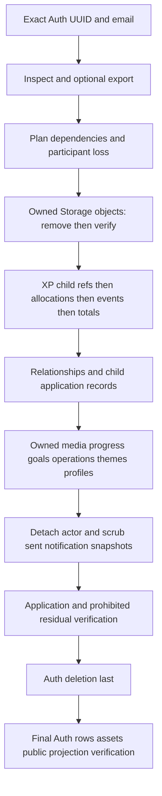

# V1-HARDENING-05C — Account export and erasure technical proof

Date: 2026-10-05. Source/synthetic evidence only; no live database, real account, Storage or Auth operation. Technical evidence is not legal approval or deployment approval.

## Baseline and acceptance

Branch `release/v1-hardening`; clean starting HEAD `2edd8af879bccbad64530abeb5b7c7f891bba0ac`, same local remote tracking ref. 05B committed; [exact-HEAD CI 37353642634](https://github.com/Baglare/MediaTracker/actions/runs/37353642634) completed/success. Prior phase history and 05A/05B reports preserved. Read workspace/repository/Supabase AGENTS and `.ai` authority/routing. Configured Vault retrieval in 05B failed `VAULT_GIT_INVALID`; no broad Vault search or write. Explicit no-commit/push also excludes autopilot Vault commits.

Primary authorities: [05A](V1_HARDENING_05A_PRIVACY_DATA_MAP.md), [05B](V1_HARDENING_05B_PRIVACY_NOTICE_AND_REQUESTS.md), ordered migrations and current application semantics. Current read-only `kc vault context` again returned `VAULT_GIT_INVALID`; no Vault candidate/write/commit/push and no guessed destination. The older proposed phase labels in 05A section 22 are superseded by this task's C/D/E ordering; historical evidence is unchanged.

`ACCOUNT_EXPORT_TECHNICAL_PROOF = CLOSED` **for the versioned bundled synthetic source only**.

`ACCOUNT_ERASURE_TECHNICAL_PROOF = BLOCKED_MANUAL` **for an operational account workflow**. The in-memory workflow passes; an actual privileged source/cleanup adapter is not implemented. The XP SQL candidate is statically checked, not executed. Do not represent this as a usable real-account export/eraser or deployed fix.

`LIVE_DISPOSABLE_DB_PROOF = NOT_RUN`. No confirmed existing credential-free disposable target was established; no connection attempted. This did not prevent source/model work.

## Ops boundary and identity

`scripts/privacy-account-ops.mjs` supports inspect, export, erase-plan, erase and verify against the **bundled synthetic source only**. Defaults to dry-run. Execution requires `--execute`, exact `ERASE SYNTHETIC <UUID>` and explicit dependent-participant-loss acknowledgement. Unknown/duplicate options, credentials, supplied data files and every live/staging/production target are refused. No SDK/database client/fetch/env loader is imported. No application runtime import or HTTP route exists.

Required explicit contract: `--source synthetic --environment synthetic --supabase-url http://127.0.0.1:54321 --fingerprint mediatracker-privacy-fixture-v1 --user-id <synthetic UUID> --email <exact synthetic registered email>`. The URL is a contract label; **no server is contacted**. No privileged credential is required/accepted by this synthetic source. A future real adapter must keep its credential solely in the local ops process and requires separate reviewed target binding, not these fixture flags. Existing `d8-staging-target.mjs` authorizes staging work and is deliberately not used to authorize prohibited privacy mutations.

Email → exactly one Auth identity → explicitly supplied UUID. Username/display name/partial email/first result cannot resolve a target. `resolveIdentity` checks uniqueness and UUID agreement. Real identity verification, representation and secure delivery remain the operator's responsibility under 05B.

CLI starts a fresh fixture per invocation. Its erase/verify report applies to that invocation; running a new verify command does not inspect a previous invocation's state. No persistent operation journal or export file is created. Export JSON goes to stdout only for synthetic data; a future real adapter needs restricted delivery/storage and minimal evidence retention.

## Dependency inventory

05A section 6 contains create columns and every added column. Current source still defines **39 public tables plus six private limiter tables**; a migration-coverage test requires all public tables to have an explicit classification. No new application account table was discovered. `scripts/privacy-account-model.mjs` is the explicit export allowlist/selection contract, not an RLS replacement.

In the table below: **C** = Auth FK CASCADE; **S** = SET NULL; **R** = RESTRICT; **N** = NO ACTION; **—** = no Auth FK. JSON/free text is not an FK. Updated-at triggers do not erase content. Only XP events/allocations have the immutable DELETE blocker; no other account DELETE guard was found in the ordered migrations. Profile publication is RPC/visibility-scoped, not whole-row public access.

| Table | Ownership / participants | FK / dependent behavior | Embedded references / residual | Proposed class |
| --- | --- | --- | --- | --- |
| profiles | id | C | public fields, assets, public_theme_snapshot | DELETE |
| media_items | user_id | C | metadata/manual calendar, notes | DELETE |
| progress_logs | user_id | C; effective composite media FK S(media_id) | detached title/id; owner stays | DELETE |
| recommendation_feedback | user_id | C | prompt, metadata | DELETE |
| profile_username_history | user_id | C | username/reservation | DELETE |
| profile_modules | user_id | C | config/public modules | DELETE |
| profile_media_showcase | user_id | C | public media projection | DELETE |
| profile_stats_snapshots | user_id | C | world_counts/public aggregate | DELETE |
| profile_progression_snapshots | user_id | C | world_counts/public XP | DELETE |
| profile_shared_notes | user_id | C | public/shared content | DELETE |
| profile_follows | follower_id, following_id | C both | relationship/participant | DELETE |
| profile_blocks | blocker_id, blocked_id | C both | target's authored blocks export; incoming blocks withheld | DELETE |
| social_activity_preferences | user_id | C | activity visibility choices | DELETE |
| social_activity_events | actor_id | C | media_snapshot/public text; child comments | DELETE |
| social_activity_comments | author_id | C; activity/parent comment C | another person's replies may cascade | DELETE with dependency acknowledgement |
| social_reactions | user_id | C; activity/comment C | other-user relationship to erased container | DELETE with dependency acknowledgement |
| social_recommendations | sender_id, recipient_id | C both | shared notes/media_snapshot; not recipient library | DELETE shared relationship |
| social_recommendation_events | actor_id | C; recommendation C | safe_metadata/internal dedupe withheld | DELETE with dependency acknowledgement |
| social_recommendation_messages | author_id through profiles | profiles C; recommendation C | visible participant messages vs hidden others' messages | DELETE with dependency acknowledgement |
| social_notification_preferences | user_id | C | notification choices | DELETE |
| social_notifications | recipient_id; actor_id | recipient C, actor S | safe_payload/entity_id/dedupe can retain actor | DELETE received; ANONYMIZE + DETACH sent |
| social_reports | reporter_id | C; activity/comment C | report note; other reporter's report may cascade | DELETE with dependency acknowledgement; legal-hold review required |
| xp_events | user_id | C; immutable DELETE trigger | metadata/source/canonical identifiers | DELETE only through proposed private XP helper |
| xp_event_allocations | event_id through xp_events | event R; immutable DELETE trigger | no direct Auth FK | DELETE before event |
| xp_user_totals | user_id | C | account aggregate, not non-identifying | DELETE |
| xp_user_world_totals | user_id | C | account aggregate | DELETE |
| xp_user_branch_totals | user_id | C | account aggregate | DELETE |
| xp_legacy_imports | user_id | C; event R | aggregate account state | DELETE before event |
| xp_user_quest_progress | user_id | C; reward event R; quest definition R | reward linkage | DELETE before event |
| xp_user_badges | user_id | C; source event R; badge definition R | public selection | DELETE before event |
| xp_media_entitlements | user_id | C | allocations JSON/hash | DELETE |
| xp_local_state_conversions | user_id | C; correction event N | metadata/internal history | DELETE before event |
| user_theme_preferences | user_id | C | active_theme_selection/custom_themes | DELETE |
| goals | user_id | C | definition, revision/tombstone | DELETE |
| cloud_media_sync_operations | user_id | C | request_hash/result/dedupe retained during account life | DELETE on account erasure |
| goal_sync_operations | user_id | C | request_hash/result/idempotency | DELETE on account erasure |
| embedding_cache | no owner | — | dormant text_preview; account attribution unknown | LEGAL_HOLD_OR_REVIEW; no guessed deletion |
| xp_quest_definitions | no owner | — | global criteria | RETAIN_NON_IDENTIFYING |
| xp_badge_definitions | no owner | — | global definitions | RETAIN_NON_IDENTIFYING |
| private_rate_limit.policies | no Auth FK | — | global configuration | RETAIN_NON_IDENTIFYING |
| private_rate_limit.buckets | HMAC subject_digest, no UUID mapping | — | pseudonymous security state | expiry cleanup; not asserted anonymous |
| private_rate_limit.request_receipts | nonce/envelope_digest | — | security receipt | expiry cleanup |
| private_rate_limit.capacity | no owner | — | global counters | RETAIN_NON_IDENTIFYING |
| private_rate_limit.global_state | no owner | — | quota/cooldown/day state | RETAIN_NON_IDENTIFYING |
| private_rate_limit.secret_refs | no owner | — | key reference; never exported | ops configuration; retained outside account workflow |
| private_privacy_ops.xp_cleanup_context (new candidate) | user_id + backend/transaction | no Auth FK; private RLS/revoked roles | temporary target capability; never exported | DELETE before helper returns; rollback on failure |

Auth platform identity tables are vendor-admin scope, not invented application tables. Auth export uses only id/email/created/confirmed/last-sign-in timestamps. Profile asset ownership is the exact first `profile-assets` path segment, not a CASCADE FK. Browser calendar user metadata is included in owned media metadata; browser-only release state is outside account source. Ownerless embedding vectors cannot be assigned by guessing the requester.

## Deterministic graph and ordering

Future actual SQL sequence: hold/quiesce account writes and revoke sessions under separate authority; inspect/export first; remove and verify every owned Storage object; in application transaction clear XP conversion/import/quest/badge refs, allocations, events, entitlements/world/branch/totals; preview and acknowledge dependent social rows; delete relationship child rows, comments/reactions/reports then activity/recommendations, follows/blocks; delete owner progress before media, goals and both operation journals, themes and profile child projections/preferences/history; scrub sent notifications; delete profile; verify all rows and embedded prohibited references; delete Auth; verify again. Do not use Auth CASCADE as the sole cleanup mechanism. Stale Cloud/device writes and in-flight requests require a real operational quiescence/authorization design; that is **not implemented by the in-memory model**.

Existing social CASCADE semantics remove replies/reactions/reports/messages whose container is erased. The model previews dependent loss and refuses execution without acknowledgement. This does not authorize deleting another user's independent library/profile/XP. Actual policy approval, legal holds and a preserve/detach alternative for shared threads remain operator/design requirements before a real adapter. No FK, RLS or historic migration is changed to make this easier.

## XP blocker and forward-only candidate

`20260721140000_xp_v2_progression.sql:192–199` unconditionally raises `xp_event_immutable` for both UPDATE/DELETE on events and allocations. Deleting the account cannot solve this: allocation/import/reward/source FKs are RESTRICT and conversion correction is NO ACTION. A delete in any order hits either a guard or a referencing FK.

Candidate [20261005120000_privacy_xp_ops_cleanup.sql](../supabase/migrations/20261005120000_privacy_xp_ops_cleanup.sql) introduces an unexposed private helper. Permissions revoke PUBLIC/anon/authenticated/service_role schema/table/helper access. Only session/current user `postgres` plus exact backend/transaction/account context permits DELETE of that account's events/allocations. UPDATE always raises. No client-writable GUC, public endpoint, trigger disable, changed FK or web credential. A cross-owner XP link aborts. Child refs are removed before allocations/events; transaction failure rolls back context/data; successful helper removes context. Repeated cleanup is a no-op. Five-second statement and one-second lock limits bound failure.

**Candidate only:** unauthorized invocation is checked as a grant/search-path source contract, not by executing real database roles. Postgres ownership and actual hosted role/schema exposure require future disposable database validation and separately authorized deployment. No deployment claim.

## Export schema and isolation

`MediaTrackerAccountPrivacyExport`, schemaVersion 1: generatedAt, safe identity, scope, sourceCategories, categories, assets and warnings. Each of 36 account-associated public domains has an explicit field allowlist and a complete-source-array requirement. Unknown tables/missing categories fail closed. Auth hashes/tokens/keys/app_metadata/user_metadata are excluded; nested credential/private/email fields and tokenized URLs are removed/redacted. User-authored free text is exported as user data; arbitrary secrets typed inside prose cannot be guaranteed absent by pattern filtering. Actual platform credentials are not loaded by the tool.

Only requester-owned content and requester-visible participant thread messages/events enter export. Other participants' hidden messages, incoming block lists, private profiles/emails/library/XP and internal metadata are withheld. Notification actor/type/entity/timestamps are represented; payload/internal dedupe withheld. Operational type/status/revision/time retained; raw hashes/result blobs excluded. Arrays and nested keys are sorted for deterministic output at an explicit generatedAt. Unknown future fields require a reviewed format update.

Assets: safe owned bucket/path/MIME/size metadata only. No binary bytes, signed URLs or access credentials. Separate operator delivery is required for binary files. Prefix validation rejects traversal, encoded separators, backslashes, adjacent UUID prefixes and other buckets.

`ACCOUNT_EXPORT != COMPLETE_DEVICE_LOCAL_EXPORT`: portable backup and separate theme export/browser controls cover supported device-local domains; server never has browser-only data it did not receive. No fabricated vendor logs/backups/mail records.

## Interruption, residuals and acceptance evidence

The adapter contract runs storage-remove → storage-verify → application-cleanup → application-verify → auth-delete → verify. A failing stage emits FAIL/retryable, stops subsequent stages and never recreates deleted data. Retrying after each simulated Storage/application/Auth failure is tested; already absent rows/assets/Auth are nonfatal. Each retry recomputes dependencies from current state.

Verification reports Auth, owned rows, assets, actor snapshots, public profile/search source projection and prohibited residual UUIDs. Unknown/cross-owner JSON references block before mutations; post-cleanup residuals stop Auth deletion. Actual search/CDN/cache invalidation is not proven by a fixture profile check. A whole-row UUID scan is conservative, but does not prove absence of names/emails copied into arbitrary third-party prose. Vendor backups/logs, local browser/export files and legitimate recipient copies remain outside app control. Never claim all personal data deleted everywhere.

Initial focused proof: 15 Node tests PASS, zero failed/skipped/todo, via existing offline guard; public-schema classification, export A/B, credential filtering, identity uniqueness, Storage prefix, child selection, dry-run, ordering, idempotency, interruptions, residuals, target refusals and migration contracts. Consolidated validation is recorded in 05E.

## Exact remaining technical blocker and remediation

**V1-HARDENING-05C BLOCKED — real operational adapter and concurrency-safe account quiescence are absent.** An in-memory adapter is not a substitute for application/Storage/Auth enforcement. This is separate from legal gates.

Concrete race evidence: Cloud v2's owner RPCs use `v_user := auth.uid()` and can insert media/progress (`20260727120000_cloud_media_schema_v2_additive.sql:830/904/1051/1127`); Goal RPC likewise inserts owner goals (`20260803120000_goal_cloud_v1_additive.sql:122/160/177`). `app/api/xp/route.ts` authenticates and invokes `xp_sync_media_states`; XP/social/showcase paths can create new immutable events. The private XP cleanup lock/context only surrounds XP cleanup, not a cross-store account-wide deny-write barrier. A still-valid account request can race between application verification and final Auth deletion, recreate an XP/Cloud row and invalidate the plan (new XP can block the final cascade again). Deleting earlier or disabling triggers would violate the required ordering/integrity. The fixture has no concurrent authenticated writer and cannot prove this race closed. The shared-container CASCADE graph also demonstrably removes other participants' replies/messages/reports, so actual execution needs the explicit preservation/erasure policy rather than silently choosing it.

Minimal next implementation requires a reviewed local ops-only adapter under `scripts/`, paginated account-scoped source reads, complete post-erasure schema/residual queries, transactional application cleanup, Storage API checks, Auth-admin-last and retry evidence. Establish a target independently as disposable; bind URL/project fingerprint/environment/ops credential without accepting production/staging during testing. Prove PostgreSQL guard/grants/FK behavior, cross-user container semantics and no stale-write resurrection. The XP forward migration candidate is required; further migration need depends on the chosen participant preservation/quiescence contract. Required files: existing account ops/model/fixture tests, the XP migration, a new ops adapter and its SQL/test support. No normal-runtime privacy endpoint or service-role addition is permitted.

08 participant source correction: B-owned recommendation-derived activity survives with neutral title/mediaType and bounded `canonicalKey=privacy-detached-activity:<surviving activity ID>`. The key is internal detachment provenance, never an invented provider/media identity and never derived from the erased account. Entire old media/text attribution is discarded. Operational SQL, synthetic cleanup and residual verification use this policy; the original SQL CHECK is unchanged. Source regression passes do not establish disposable PostgreSQL/Auth/Storage execution.
